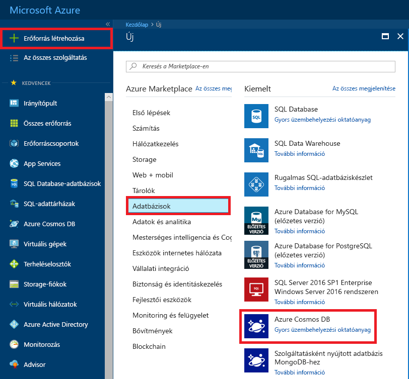
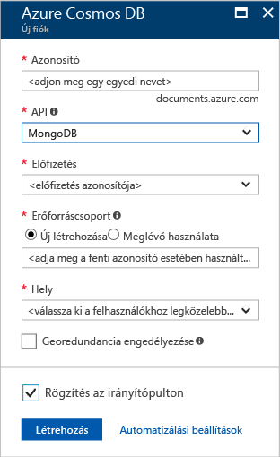
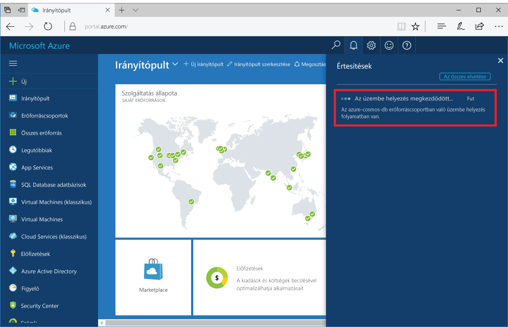
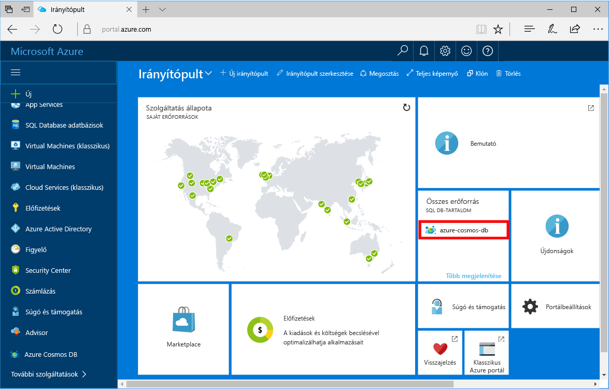

1. Egy új ablakban jelentkezzen be az [Azure Portalra](https://portal.azure.com/).
2. A bal oldali menüben kattintson az **Erőforrás létrehozása**, az **Adatbázisok**, majd az **Azure Cosmos DB** területen a **Létrehozás** elemre.
   
   

3. Az **Új fiók** panelen adja meg a **MongoDB** API-t, és töltse ki az Azure Cosmos DB-fiók kívánt konfigurációját.
 
    

    * Az **Azonosítónak** az Azure Cosmos DB-fiók azonosításához használni kívánt egyedi névnek kell lennie. Az azonosító csak kisbetűket, számokat és a '-' karaktert tartalmazhatja, és 3–50 karakter hosszúságú lehet.
    * Az **Előfizetés** az Ön Azure-előfizetése. A rendszer ezt automatikusan kitölti.
    * Az **Erőforráscsoport** az Azure Cosmos DB-fiók erőforráscsoportjának neve.
    * A **Hely** az a földrajzi hely, ahol az Azure Cosmos DB-példány található. Válassza ki a felhasználókhoz legközelebb eső helyet.

4. A fiók létrehozásához kattintson a **Létrehozás** gombra.
5. Az eszköztáron kattintson az **Értesítések** parancsra az üzembe helyezési folyamat megfigyeléséhez.

    

6.  Amikor befejeződött a telepítés, nyissa meg az új fiókot az Összes erőforrás csempén. 

    
