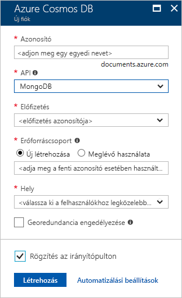
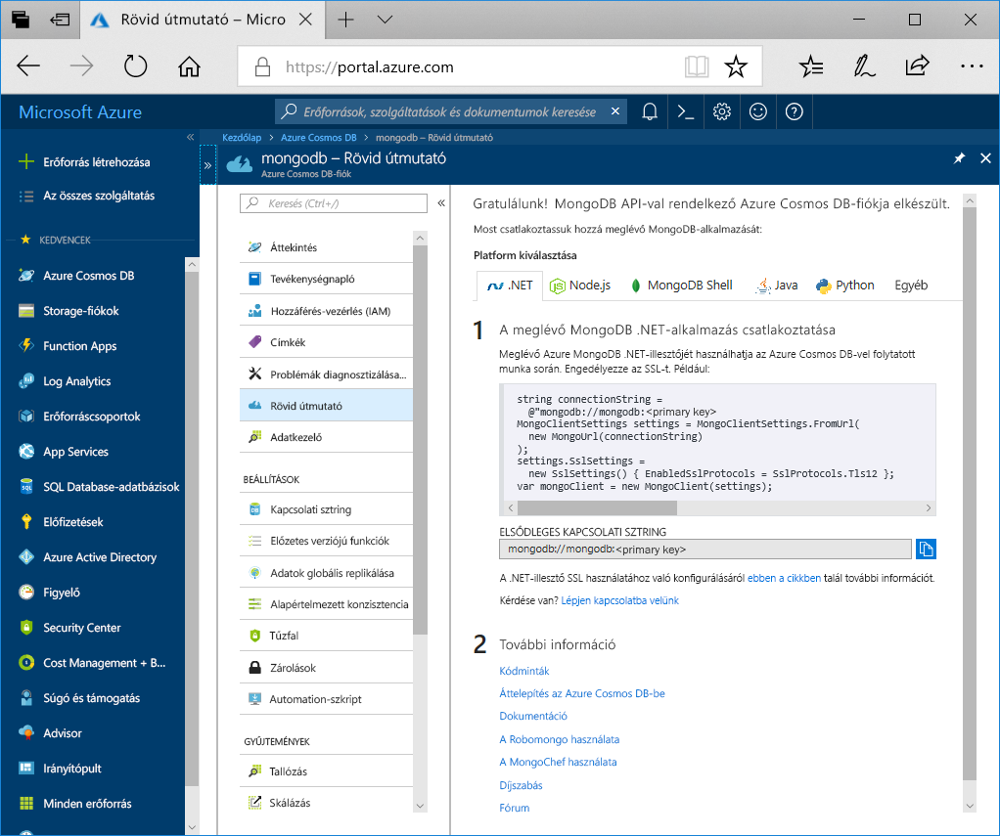

1. Egy új ablakban jelentkezzen be az [Azure Portalra](https://portal.azure.com/).
2. A bal oldali menüben kattintson az **Erőforrás létrehozása**, az **Adatbázisok**, majd az **Azure Cosmos DB** területen a **Létrehozás** elemre.
   
   

3. Az **Új fiók** panelen adja meg a **MongoDB** API-t, és töltse ki az Azure Cosmos DB-fiók kívánt konfigurációját.
 
    * Az **Azonosítónak** az Azure Cosmos DB-fiók azonosításához használni kívánt egyedi névnek kell lennie. Az azonosító csak kisbetűket, számokat és a '-' karaktert tartalmazhatja, és 3–50 karakter hosszúságú lehet.
    * Az **Előfizetés** az Ön Azure-előfizetése. A rendszer ezt automatikusan kitölti.
    * Az **Erőforráscsoport** az Azure Cosmos DB-fiók erőforráscsoportjának neve. Válassza ki az **Új létrehozása** elemet, majd adja meg a fiók új erőforráscsoport-nevét. Az egyszerűség kedvéért használhat az azonosítójával megegyező nevet.
    * A **Hely** az a földrajzi hely, ahol az Azure Cosmos DB-példány található. Válassza ki a felhasználókhoz legközelebb eső helyet.

    Ezt követően kattintson a **Create** (Létrehozás) gombra.

    

4. A fiók létrehozása eltarthat néhány percig. Várja meg, hogy a portálon megjelenjen a **Gratulálunk! MongoDB API-val rendelkező Azure Cosmos DB-fiókja elkészült** lap.

    
