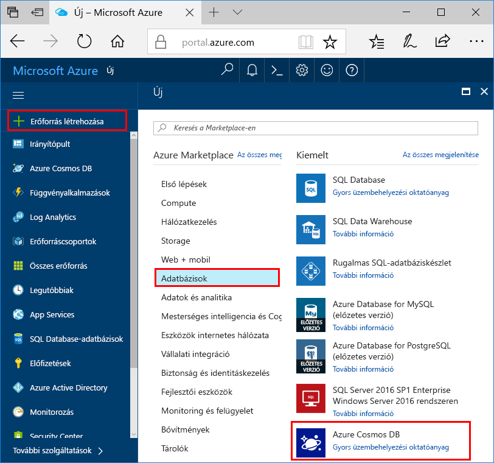
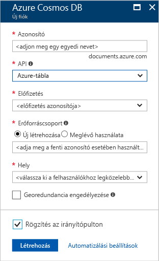

1. Egy új ablakban jelentkezzen be az [Azure Portalra](https://portal.azure.com/).
2. A bal oldali menüben kattintson az **Új**, az **Adatbázisok**, majd az **Azure Cosmos DB** elemre.
   
   

3. Az **Új fiók** panelen adja meg az Azure Cosmos DB-fiók kívánt beállításait. 

    Az Azure Cosmos DB használata esetén négy programozási modell közül választhat: Gremlin (gráf), MongoDB, SQL (DocumentDB) és a tábla (kulcs-érték). 
    
    Ebben a rövid útmutatóban a Table API használatával fogunk programozni, tehát a **Table (kulcs-érték)** lehetőséget fogja választani az űrlap kitöltésekor. Ha azonban közösségi média gráfadataival, a katalógusalkalmazásból származó dokumentumadatokkal vagy MongoDB-alkalmazásból áttelepített adatokkal dolgozik, vegye figyelembe, hogy az Azure Cosmos DB magas rendelkezésre állású, globálisan elosztott adatbázis-szolgáltatási platformot tud biztosítani az összes alapvető fontosságú alkalmazáshoz.

    Adja meg az adatokat az Új fiók panelen a képernyőfelvételen látható információk alapján. A fiók beállítása során egyedi értékeket fog választani, vagyis az értékek nem fognak pontosan egyezni a képernyőképen szereplő adatokkal. 
 
    

    Beállítás|Ajánlott érték|Leírás
    ---|---|---
    ID (Azonosító)|*Egyedi érték*|Az Azure Cosmos DB-fiók azonosításához választott egyedi név. A rendszer a *documents.azure.com* utótaggal egészíti ki a megadott azonosítót az URI létrehozásához, ezért válasszon egyedi, de felismerhető azonosítót. Az azonosító csak kisbetűket, számokat és kötőjel (-) karaktert tartalmazhat, és 3–50 karakter hosszúságú lehet.
    API|Table (kulcs-érték)|Ebben a cikkben a [Table API](../articles/cosmos-db/table-introduction.md) használatával fogunk programozni.|
    Előfizetés|*Az Ön előfizetése*|Az Azure Cosmos DB-fiókhoz használni kívánt Azure-előfizetés. 
    Erőforráscsoport|*Megegyezik az azonosítóval*|A fiók új erőforráscsoport-neve. Az egyszerűség kedvéért használhat az azonosítójával megegyező nevet. 
    Hely|*A felhasználókhoz legközelebb eső régió*|Az a földrajzi hely, ahol az Azure Cosmos DB-fiókot üzemeltetni fogja. Válassza ki a felhasználókhoz legközelebb lévő helyet, hogy a lehető leggyorsabb hozzáférést biztosítsa az adatokhoz.   

4. A fiók létrehozásához kattintson a **Létrehozás** gombra.
5. Az eszköztáron kattintson az **Értesítések** parancsra az üzembe helyezési folyamat megfigyeléséhez.

    

6.  Amikor befejeződött a telepítés, nyissa meg az új fiókot az Összes erőforrás csempén. 

    
