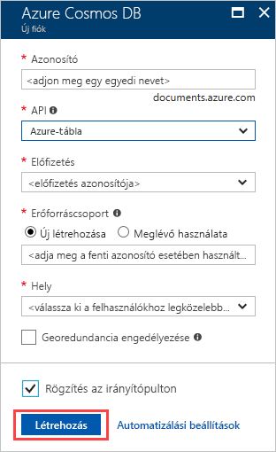
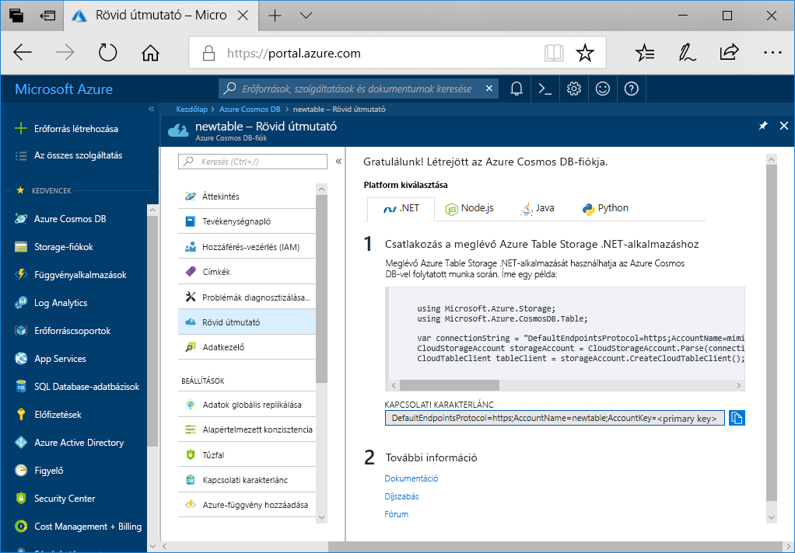

1. Egy új böngészőablakban jelentkezzen be az [Azure Portalra](https://portal.azure.com/).
2. A bal oldali navigációs panelen válassza ki **erőforrás létrehozása**. Válassza ki **adatbázisok** majd **Azure Cosmos DB**.
   
   

3. Az a **létrehozása az Azure Cosmos DB-fiók** lap, adja meg az új Azure Cosmos DB-fiók beállításait:
 
    Beállítás|Érték|Leírás
    ---|---|---
    Előfizetés|Az Ön előfizetése|Válassza ki az Azure Cosmos DB-fiókhoz használni kívánt Azure-előfizetést. 
    Erőforráscsoport|Új létrehozása  A használt egyedi nevet majd adja meg a azonosítója|Válassza az **Új létrehozása** lehetőséget. Majd adjon meg egy új erőforráscsoport neve a fiókjához. Az egyszerűség kedvéért használja ugyanazt a nevet, az azonosítóját. 
    Fiók neve|Adjon meg egy egyedi nevet|Adjon meg egy egyedi nevet az Azure Cosmos DB-fiók azonosításához.  Az azonosító csak kisbetűket, számokat és a kötőjel (-) karaktert használhat. 3. és 31 karakter között kell lennie.
    API|Azure-tábla|A létrehozni kívánt fiók típusát az API határozza meg. Az Azure Cosmos DB öt API-kat biztosít: A dokumentum-adatbázis Core(SQL) a Gremlin gráf típusú adatbázisokat, a MongoDB, a dokumentum-adatbázis, az Azure Table és a Cassandra. Jelenleg minden API egy külön fiókot kell létrehoznia.   Válassza ki **Azure Table** mivel ebben a rövid útmutatóban hoz létre egy táblát, amely a Table API-val működik.   [További információ a Table API](../articles/cosmos-db/table-introduction.md).|
    Hely|Válassza ki a felhasználóihoz legközelebb eső régiót|Válassza ki az Azure Cosmos DB-fiókot üzemeltetéséhez használni kívánt földrajzi helyet. A felhasználók számára tegye lehetővé számukra a lehető leggyorsabb hozzáférést biztosítsa az adatok legközelebb eső helyet használja.

    Hagyhatja az **Georedundancia** és **többrégiós ír** beállításokat alapértelmezett értékükön (**letiltása**) RU további díjak elkerülése érdekében. Folytassa a **hálózati** és **címkék** szakaszokat.

5. Válassza ki **felülvizsgálat + létrehozás**. Az érvényesítés befejezése után jelölje ki a **létrehozás** a fiók létrehozásához. 
 
   

6. A fiók létrehozása pár percet vesz igénybe. Ekkor megjelenik egy üzenet arról, hogy **folyamatban van a központi telepítés**. Várjon, amíg befejeződnek, és válassza ki a központi telepítés **erőforrás megnyitása**.

    
