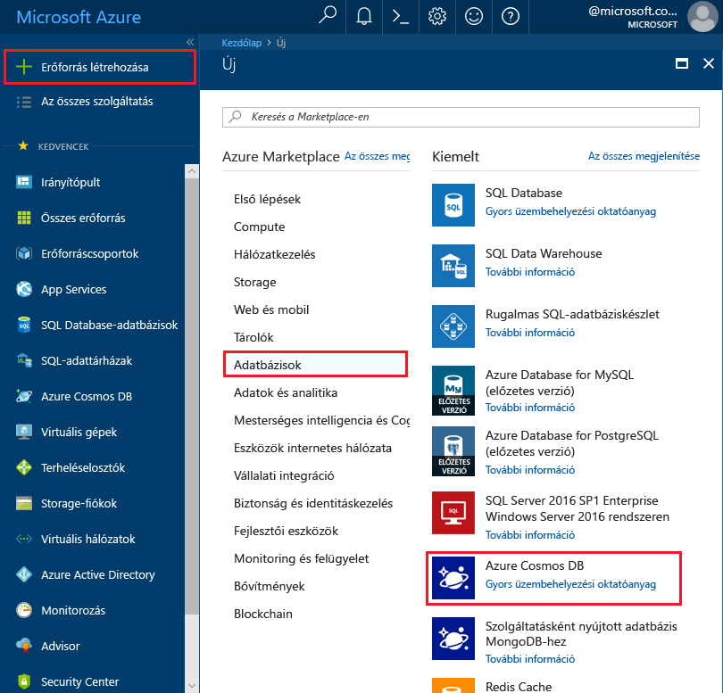
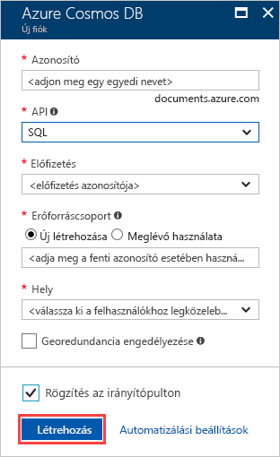

1. Egy új böngészőablakban, jelentkezzen be a [Azure-portálon](https://portal.azure.com/).
2. Kattintson a **új** > **adatbázisok** > **Azure Cosmos DB**.
   
   

3. Az a **új fiók** lapján adja meg az új Azure Cosmos DB fiók beállításait. 
 
    Beállítás|Ajánlott érték|Leírás
    ---|---|---
    ID (Azonosító)|*Adjon meg egy egyedi nevet*|Adjon meg egy egyedi nevet a Azure Cosmos DB fiók azonosításához. A rendszer a *documents.azure.com* utótaggal egészíti ki a megadott azonosítót az URI létrehozásához, ezért válasszon egyedi, de felismerhető azonosítót.  Az azonosító csak kisbetűket, számokat és a kötőjel (-) karaktert tartalmazhatja, valamint 3–50 karakter hosszúságúnak kell lennie.
    API|SQL|Az API-t határozza meg a fiók létrehozásához. Az Azure Cosmos DB biztosít öt API-k az alkalmazás igényeinek leginkább megfelelő: SQL (a dokumentum-adatbázis), Gremlin (graph adatbázis), a mongodb-Protokolltámogatással (a dokumentum-adatbázis), Azure Table és Cassandra, minden egyes igénylő jelenleg egy külön fiókot.   Válassza ki **SQL** , mert a gyors üzembe helyezés lekérdezhető SQL-szintaxis használatával és az SQL API-hoz elérhető a dokumentum adatbázis létrehozásához.  [További információ az SQL API](../articles/cosmos-db/documentdb-introduction.md)|
    Előfizetés|*Az Ön előfizetése*|Válassza ki a Azure Cosmos DB fiókhoz használni kívánt Azure-előfizetéshez. 
    Erőforráscsoport|Új létrehozása  *Azonosító a fent ismertetett adja meg az egyedi neve*|Válassza ki **hozzon létre új**, írjon be egy új erőforráscsoport nevet a fiókjához. Az egyszerűség kedvéért használhat az azonosítójával megegyező nevet. 
    Hely|*Válassza ki a felhasználók a legközelebb eső régiót*|Válassza ki a földrajzi helyet, ahol Azure Cosmos DB fiókja üzemeltetéséhez. A felhasználók számára, hogy biztosítsa a leggyorsabb hozzáférést az adatok legközelebbi helyet használja.
    Georedundancia engedélyezése| Hagyja üresen | Ez az adatbázis egy replikált verziót egy második (párosított) régióban hoz létre. Hagyja üresen a mezőt.  
    Rögzítés az irányítópulton | Válassza ezt: | Válassza ezt a jelölőnégyzetet, hogy az új adatbázis-fiókja hozzáadódik a portál irányítópultján egyszerűen hozzáférhetnek.

    Ezt követően kattintson a **Create** (Létrehozás) gombra.

    

4. A fiók létrehozásának folyamata eltart néhány percig. Során fiók létrehozása a portál megjeleníti a **telepítése Azure Cosmos DB** csempére a jobb oldalon görgessen jobbra az irányítópulton a csempe szeretne. A képernyő felső részén látható folyamatjelző segítségével is van. A folyamatban lévő vagy területe figyelemmel követheti. 

    

    Ha a fiók létrejött, a **Gratulálunk! A Azure Cosmos DB-fiók létrejött** lap is megjelenik. 

