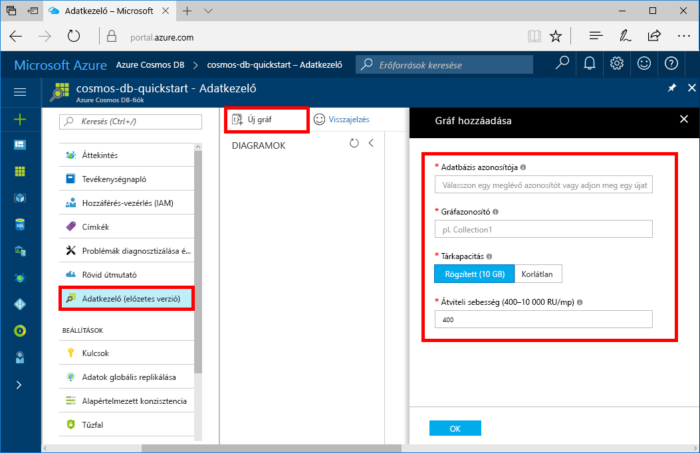

Az Adatkezelővel gráftárolókat hozhat létre, és adatokat adhat hozzá adatbázisához. 

1. Az Azure Portalon kattintson a navigációs menü **Adatkezelő** elemére. 
2. Az Adatkezelő panelen kattintson az **Új gráf** elemre, majd töltse ki a lapot az alábbi információk alapján.

    

    Beállítás|Ajánlott érték|Leírás
    ---|---|---
    Adatbázis azonosítója|sample-database|Az új adatbázis azonosítója. Az adatbázis neve 1–255 karakter hosszúságú lehet, és nem tartalmazhat `/ \ # ?` karaktereket vagy záró szóközt.
    Gráfazonosító|sample-graph|Az új gráfhoz tartozó azonosító. A gráfok nevére ugyanazok a karakterkorlátozások vonatkoznak, mint az adatbázis-azonosítókra.
    Tárkapacitás| 10 GB|Ne módosítsa az alapértelmezett értéket. Ez az adatbázis tárkapacitása.
    Teljesítmény|400 kérelemegység|Ne módosítsa az alapértelmezett értéket. Később lehetősége lesz növelni az átviteli sebességet a késés csökkentése érdekében.
    kérelemegység/m|Ki|Ne módosítsa az alapértelmezett értéket. Ha később spiky munkaterhelések kezelésére van szüksége, bekapcsolhatja a [kérelemegység/m](../articles/cosmos-db/request-units-per-minute.md) funkciót.
    Partíciókulcs|/userid|Az egyes partíciók között az adatokat egyenletesen elosztó partíciókulcs. A megfelelő partíciókulcs kiválasztása fontos a nagy teljesítményű gráfok létrehozásához. Erről bővebben a [Particionálásra tervezés](../articles/cosmos-db/partition-data.md#designing-for-partitioning) című részben olvashat.

3. Miután kitöltötte az űrlapot, kattintson az **OK** elemre.