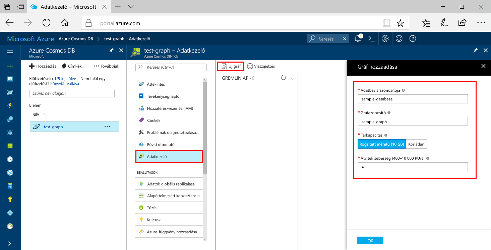

Az Azure Portal Adatkezelő eszközét mostantól gráfadatbázisok létrehozására is használhatja. 

1. Kattintson az **Adatkezelő** > **Új gráf** lehetőségre.

    A jobb szélen megjelenik a **Gráf hozzáadása** terület. Előfordulhat, hogy jobbra kell görgetnie, hogy lássa.

    

2. A **Gráf hozzáadása** oldalon adja meg az új gráf beállításait.

    Beállítás|Ajánlott érték|Leírás
    ---|---|---
    Adatbázis-azonosító|sample-database|Az új adatbázisnak adja a *sample-database* nevet. Az adatbázis neve 1–255 karakter hosszúságú lehet, és nem tartalmazhat `/ \ # ?` karaktereket vagy záró szóközt.
    Gráfazonosító|sample-graph|Az új gyűjteménynek adja a *sample-graph* nevet. A gráfok nevére ugyanazok a karakterkorlátozások vonatkoznak, mint az adatbázis-azonosítókra.
    Tárkapacitás|Rögzített méretű (10 GB)|Ne módosítsa az alapértelmezett **Rögzített méretű (10 GB)** értéket. Ez az érték az adatbázis tárkapacitása.
    Teljesítmény|400 kérelemegység|Módosítsa a teljesítményt másodpercenként 400 kérelemegységre (RU/s). Később lehetősége lesz növelni az átviteli sebességet a késés csökkentése érdekében.

3. Miután kitöltötte az űrlapot, kattintson az **OK** elemre.
