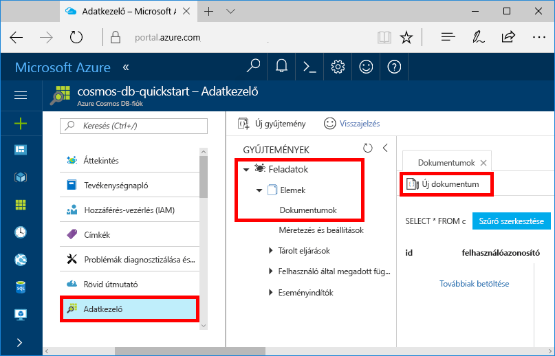
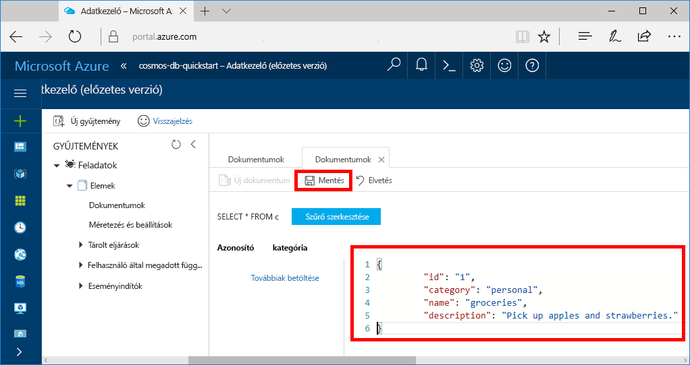

Az Adatkezelő segítségével adatokat adhat hozzá az új gyűjteményhez.

1. Az új adatbázis az Adatkezelőben a Gyűjtemények ablaktáblán jelenik meg. Bontsa ki a **Feladatok** adatbázist, majd az **Elemek** gyűjteményt, végül kattintson a **Dokumentumok**, majd pedig az **Új dokumentumok** lehetőségre. 

   
  
2. Adjon hozzá egy dokumentumot a gyűjteményhez az alábbi struktúrával.

     ```json
     {
         "id": "1",
         "category": "personal",
         "name": "groceries",
         "description": "Pick up apples and strawberries.",
         "isComplete": false
     }
     ```

3. A JSON hozzáadása után a **Dokumentumok** lapon kattintson a **Mentés** gombra.

    

4.  Hozzon létre és mentsen még egy dokumentumot, amelyben egyedi értéket szúr be az `id` tulajdonság számára, és tetszés szerint módosítja a többi tulajdonságot. Mivel az Azure Cosmos DB nem kötelezi egy adott adatséma használatára, új dokumentumaihoz bármilyen struktúrát választhat.