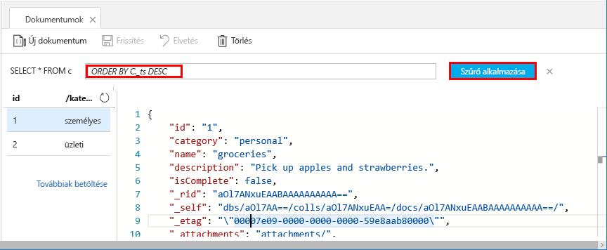

Az Adatkezelővel így már lekérdezések használatával lekérheti és szűrheti adatait.

1. Alapértelmezés szerint a lekérdezés `SELECT * FROM c` értékre van állítva. Ez az alapértelmezett lekérdezés lekéri és megjeleníti a gyűjteményben szereplő összes dokumentumot. 

    

2. Maradjon a **Dokumentumok** lapon és módosítsa a lekérdezést a **Szűrő szerkesztése** gombra kattintva, a lekérdezési predikátumhoz adja hozzá az `ORDER BY c._ts DESC` elemet, végül pedig kattintson a **Szűrő alkalmazása** elemre.

    

A módosított lekérdezés az időbélyegük alapján csökkenő sorrendben listázza a dokumentumokat, így most már a második dokumentum van a lista elején. Ha ismeri az SQL szintaxisát, bármelyik támogatott [SQL-lekérdezést](../articles/cosmos-db/sql-api-sql-query.md) megadhatja ebben a mezőben. 

Ezzel befejeződött az Adatkezelőben végzett munkánk. Mielőtt áttérünk a kódokra, ne felejtse el, hogy az Adatkezelővel létrehozhat tárolt eljárásokat, felhasználói függvényeket és a kiszolgálóoldali üzleti logikákat végrehajtó eseményindítókat is, valamint szabályozhatja az átviteli sebességet is. Az Adatkezelő hozzáférhetővé teszi az API-k összes beépített, programozható adatelérési funkcióját, és az Azure Portalon tárolt adataihoz is egyszerű hozzáférést biztosít.