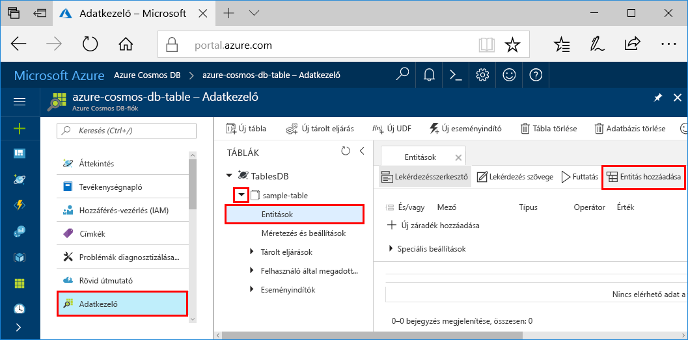
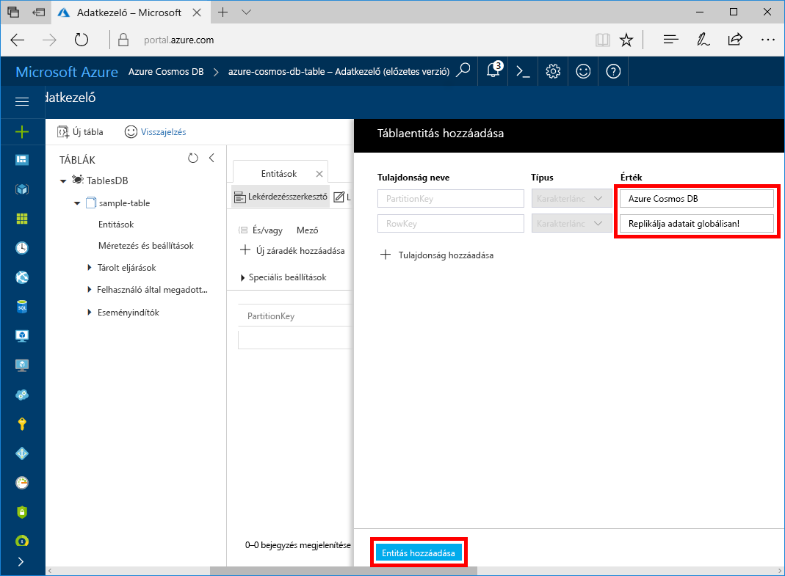

Az Adatkezelő segítségével adatokat adhat hozzá az új táblához.

1. Az Adatkezelőben bontsa ki a **minta tábla** pontot, és kattintson az **Entitások**, ezután pedig az **Entitás hozzáadása** lehetőségre.

   

2. Adja meg a PartitionKey és a RowKey mező adatait és kattintson az **Entitás hozzáadása** lehetőségre.

   
  
    Most már az Adatkezelővel további entitásokat is hozzá tud adni a táblához, szerkesztheti őket, és lekérdezéseket is indíthat. Az Adatkezelőben továbbá skálázhatja az átviteli sebességet, és tárolt eljárásokat, felhasználói függvényeket és eseményindítókat adhat hozzá a táblához.