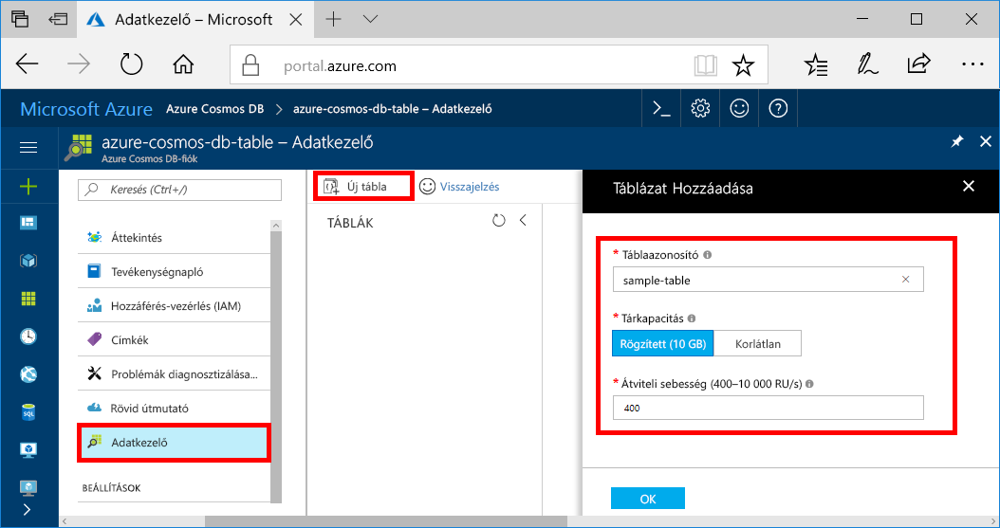
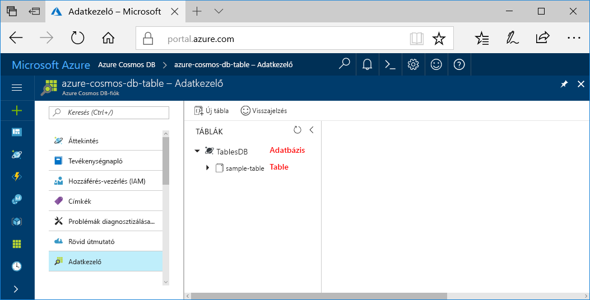

Az Azure Portal Adatkezelő eszközét mostantól adatbázis és tábla létrehozására is használhatja. 

1. Kattintson az **Adatkezelő** > **Új tábla** parancsra. 
    
    A jobb szélen megjelenik a **Táblázat hozzáadása** terület. Esetenként jobbra kell görgetnie, hogy lássa.

    

2. A **Tábla hozzáadása** oldalon adja meg az új tábla beállításait.

    Beállítás|Ajánlott érték|Leírás
    ---|---|---
    Táblaazonosító|minta tábla|Az új tábla azonosítója. A táblák nevére ugyanazok a korlátozások vonatkoznak, mint az adatbázis-azonosítókra. Az adatbázis neve 1–255 karakter hosszúságú lehet, és nem tartalmazhat `/ \ # ?` karaktereket vagy záró szóközt.
    Tárkapacitás| Rögzített méretű (10 GB)|Használja az alapértelmezett **Rögzített méretű (10 GB)** értéket. Ez az érték az adatbázis tárkapacitása.
    Teljesítmény|400 kérelemegység|Módosítsa a teljesítményt másodpercenként 400 kérelemegységre (RU/s). Később lehetősége lesz növelni az átviteli sebességet a késés csökkentése érdekében.

    Kattintson az **OK** gombra.

    Az Adatkezelő megjeleníti az új adatbázist és táblát.

    