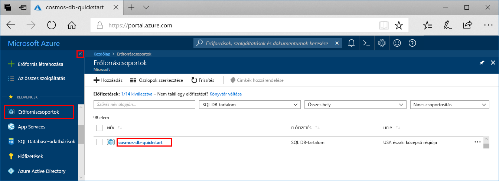
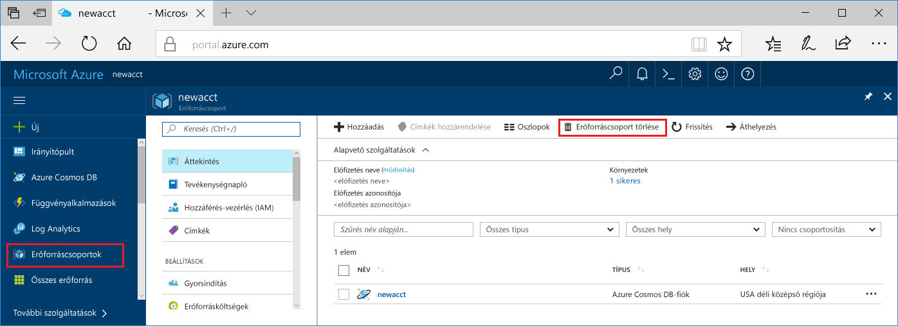

Ha nem használja tovább az alkalmazást, akkor a következő lépésekkel a mintaalkalmazás által létrehozott összes erőforrást törölheti a költségek elkerülése érdekében:

1. Az Azure Portalon válassza az **Erőforráscsoportok** lehetőséget a bal szélen, majd a létrehozott erőforráscsoport.  

    Ha a bal oldali menü összecsukódott, kattintson a  a kinyitásához.

   

2. Az új ablakban válassza ki az erőforráscsoportot, és kattintson az **Erőforráscsoport törlése** elemre.

      

3. Az új ablakban írja be a törölni kívánt erőforráscsoport nevét, majd kattintson a **Törlés**  elemre.

