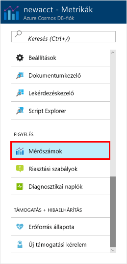
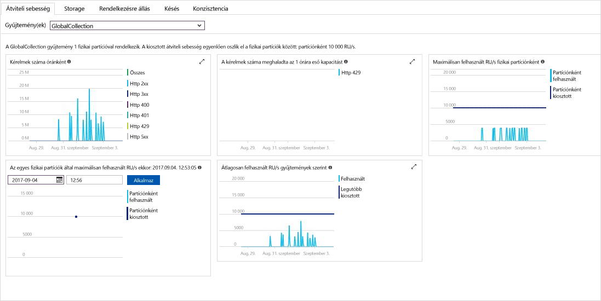

A fiókjához tartozó erőforrások adatátviteli sebessége, tárolókapacitása, rendelkezésre állása, késleltetése és konzisztenciája az Azure Portalon monitorozható. Vessünk egy pillantást ezekre a metrikákra. 

1. Kattintson a **Metrikák** elemre a navigációs menüben.

   

2. Kattintson végig az összes lapon, hogy tisztában legyen az Azure Cosmos DB által biztosított metrikákkal. 

    Az [Azure Cosmos DB szolgáltatói szerződéseihez (SLA)](https://azure.microsoft.com/support/legal/sla/cosmos-db/) tartozó összes diagram tartalmaz egy-egy vonalat, amely értesít arról, ha bármely SLA-t megsértették. Az Azure Cosmos DB ezekkel a metrikákkal átláthatóvá teszi az SLA-k monitorozását. 

   