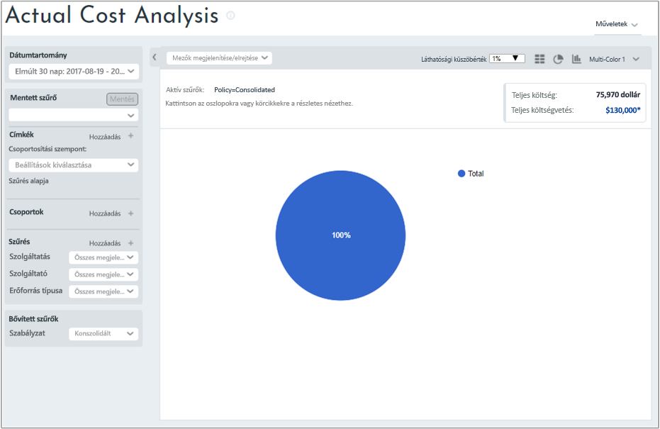
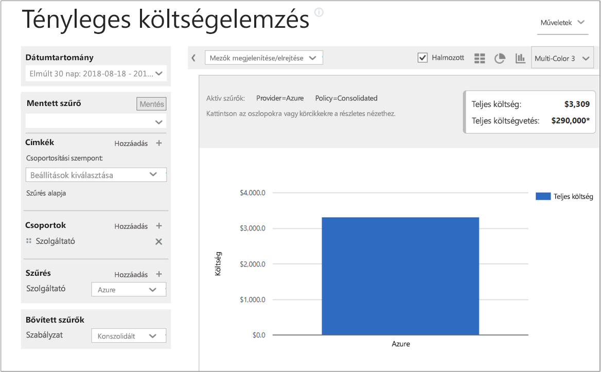
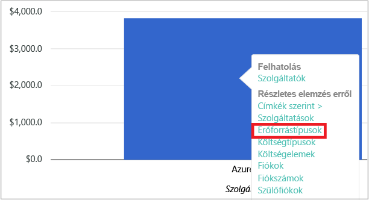
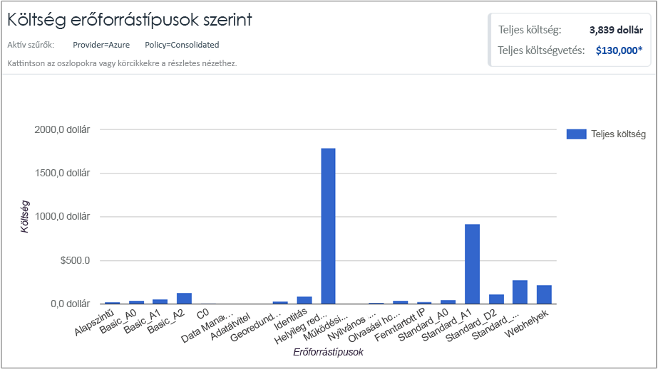
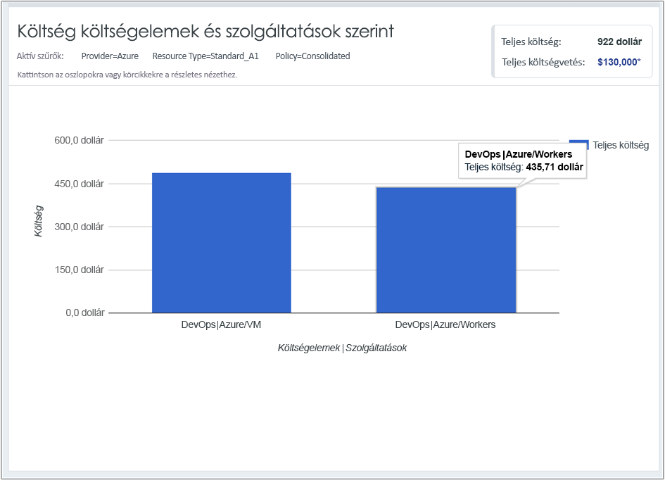

## Költségadatok megtekintése

A Cloudyn Azure Cost Management megoldása a felhőerőforrásban tárolt összes adatához hozzáférést biztosít. Az irányítópulti jelentések között a standard és egyéni jelentéseket is megtalálja többlapos nézetben. A következőkben példákat láthat népszerű irányítópultokra és egy jelentésre, amely azonnal megmutatja a költségadatokat.

Ebben a példában a Kezelési irányítópult a Contoso vállalat összes felhőerőforrásának összesített költségét jeleníti meg. A Contoso az Azure, az AWS és a Google szolgáltatásait használja. Az irányítópultok azonnali információkat biztosítanak, és használatukkal gyorsan lehet navigálni a jelentések között.  

Ha nem tudja, hogy egy jelentés miért van az irányítópulton, húzza az egeret az **i** szimbólum fölé a magyarázatának megjelenítéséhez. A teljes jelentés megjelenítéséhez kattintson bármelyik jelentésre az irányítópulton.

A jelentéseket a Portal tetején található jelentések menüből is megtekintheti. Nézzük meg a Contoso Azure-erőforrásokra vonatkozó kiadásait az elmúlt 30 napban. Kattintson a **Cost** (Költség) > **Cost Analysis** (Költségelemzés) > **Actual Cost Analysis** (Tényleges költségelemzés) elemre. Törölje a beállított címkék, csoportok és szűrők értékeit a jelentésben.

Ebben a példában a teljes költség 75 970 USD, a költségkeret pedig 130 000 USD.

Most módosítsuk a jelentés formátumát, és állítsunk be csoportokat és szűrőket, hogy az Azure-hoz kapcsolódó költségekre szűkítsük az eredményeket. Állítsa a **Date Range** (Dátumtartomány) értékét az elmúlt 30 napra. A jobb felső sarokban kattintson az oszlop szimbólumra oszlopdiagramként történő formázáshoz, majd a Csoportok területen válassza a **Provider** (Szolgáltató) lehetőséget. Ezután állítson be egy szűrőt a **Provider** (Szolgáltató) számára **Azure** értékkel.

Ebben a példában az Azure-erőforrások teljes költsége 3839 USD volt az elmúlt 30 napban.

Kattintson a jobb gombbal a Szolgáltató (Azure) oszlopra, és indítson részletes elemzést a **Resource types** (Erőforrástípusok) jellemzőről.

A következő ábra a Contoso Azure-erőforrásokkal kapcsolatos költségeit jeleníti meg. A teljes összeg 3839 USD volt. A példában körülbelül a költségek fele a helyileg redundáns tárolásból, a másik fele pedig a különböző virtuálisgép-példányokból adódott.

Kattintson a jobb gombbal egy erőforrástípusra, és válassza a **Cost Entities** (Költségelemek) lehetőséget a költségelemek és az erőforrást felhasználó szolgáltatások megjelenítéséhez. A példában a DevOps VM és a feldolgozó szolgáltatásai 486,60 USD és 435,71 USD költséget használtak fel. A kettő összege 922 USD.

Útmutató videót a felhőben, számlázási adatok megtekintésével kapcsolatban, tekintse meg a [elemzése a számlázási adatokat az Azure költség Management Cloudyn felhő](https://youtu.be/G0pvI3iLH-Y).
