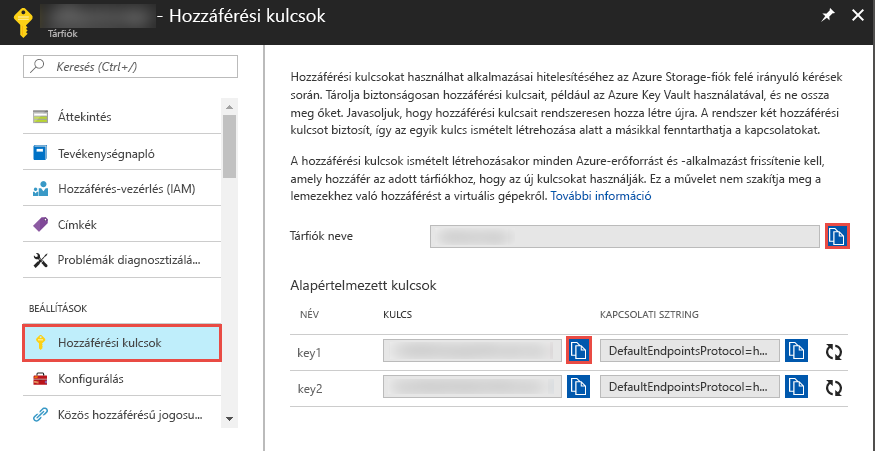

## <a name="prerequisites"></a>Előfeltételek

### <a name="azure-subscription"></a>Azure-előfizetés
Ha nem rendelkezik Azure-előfizetéssel, első lépésként mindössze néhány perc alatt létrehozhat egy [ingyenes](https://azure.microsoft.com/free/) fiókot.

### <a name="azure-roles"></a>Azure-szerepkörök
Data Factory-példányok létrehozásához a felhasználói fióknak, amellyel belép az Azure-ba, a **közreműködő** vagy **tulajdonos** szerepkörök tagjának, vagy az Azure-előfizetés **rendszergazdájának** kell lennie. Az Azure Portalon kattintson a **felhasználónévre** a jobb felső sarokban, majd válassza az **Engedélyek** elemet az előfizetésben található engedélyek megtekintéséhez. Ha több előfizetéshez is rendelkezik hozzáféréssel, válassza ki a megfelelő előfizetést. Ha szeretne példautasításokat látni egy felhasználó szerepkörhöz adására, olvassa el a [Szerepkörök hozzáadása](../articles/billing/billing-add-change-azure-subscription-administrator.md) című cikket.

### <a name="azure-storage-account"></a>Azure Storage-tárfiók neve
Ebben a rövid útmutatóban egy általános célú Azure Storage-fiókot (ebben az esetben blobtárolót) használunk **forrás-** és **céladattárként**. Ha még nem rendelkezik általános célú Azure Storage-fiókkal, tekintse meg a [Tárfiók létrehozását](../articles/storage/common/storage-create-storage-account.md#create-a-storage-account) ismertető cikket. 

#### <a name="get-storage-account-name-and-account-key"></a>Tárfióknév és fiókkulcs beszerzése
Ebben a rövid útmutatóban az Azure Storage-fiók nevét és kulcsát használjuk. Az alábbi eljárás bemutatja a tárfióknév és -kulcs beszerzéséhez szükséges lépéseket. 

1. Nyisson meg egy webböngészőt, és keresse fel az [Azure Portalt](https://portal.azure.com). Jelentkezzen be az Azure-beli felhasználónevével és jelszavával. 
2. Kattintson a **További szolgáltatások >** elemre a bal oldali menüben, állítson be egy szűrőt a **Tárfiók** kulcsszóval, majd válassza a **Tárfiókok** lehetőséget.

    
3. A tárfiókok listájában állítson be szűrőt a tárfiók nevéhez (ha szükséges), majd válassza ki a **tárfiókját**. 
4. A **Tárfiók** oldalon a menüben válassza a **Hozzáférési kulcsok** elemet.

    
5. Másolja a **Tárfiók neve** és az **1. kulcs** mezők értékét a vágólapra. Illessze be őket a Jegyzettömbbe, vagy bármely más szerkesztőbe, majd mentse a fájlt. A rövid útmutató későbbi szakaszában fogja használni őket.   

#### <a name="create-input-folder-and-files"></a>Bemeneti mappa és fájlok létrehozása
Ebben a szakaszban egy **adftutorial** nevű blobtárolót hoz létre az Azure Blob Storage-ban. Ezután létrehoz egy **input** nevű mappát a tárolóban, majd feltölt egy mintafájlt az input mappába. 

1. A **Storage-fiók** lapon váltson át az **Áttekintés** panelre, majd kattintson a **Blobok** elemre. 

    
2. A **Blob service** lapon kattintson az eszköztár **+ Tároló** elemére. 

        
3. Az **Új tároló** párbeszédablakban adja meg az **adftutorial** nevet, és kattintson az **OK** gombra. 

    
4. A tárolók listájában kattintson az **adftutorial** elemre. 

    
1. A **Tároló** lapon kattintson az eszköztár **Feltöltés** elemére.  

    
6. A **Blob feltöltése** lapon kattintson a **Speciális** elemre.

    
7. Indítsa el a **Jegyzettömböt**, és hozzon létre egy **emp.txt** nevű fájlt a következő tartalommal. Mentse a fájlt a **c:\ADFv2QuickStartPSH** mappába. Ha még nem létezik, hozza létre az **ADFv2QuickStartPSH** mappát.
    
    ```
    John, Doe
    Jane, Doe
    ```    
8. Az Azure Portal **Blob feltöltése** lapjának **Fájlok** mezőben keresse meg, és válassza ki az **emp.txt** fájlt. 
9. Adja meg az **input** értéket a **Feltöltés mappába** mezőben. 

        
10. Ellenőrizze, hogy a mappa az **input** mappa-e, a fájl pedig az **emp.txt** fájl-e, majd kattintson a **Feltöltés** elemre.
11. A listában meg kell jelennie az **emp.txt** fájlnak és a feltöltés állapotának. 
12. A sarokban található **X** gombra kattintva zárja be a **Blob feltöltése** lapot. 

    
1. Ne zárja be a **Tároló** lapot. A segítségével ellenőrizheti ennek a rövid útmutatónak az eredményét.