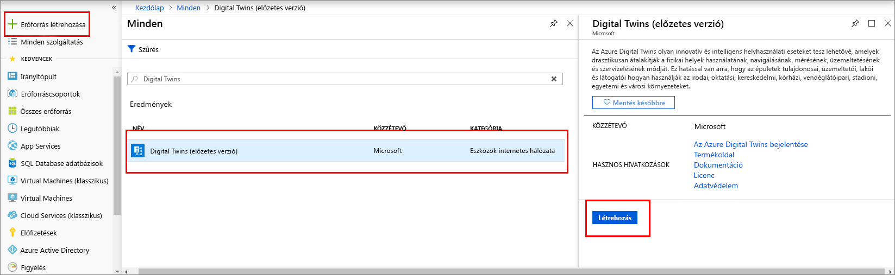
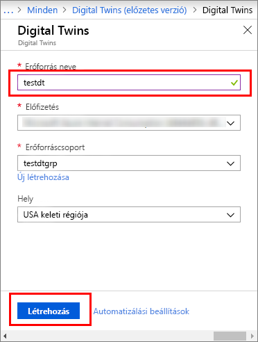
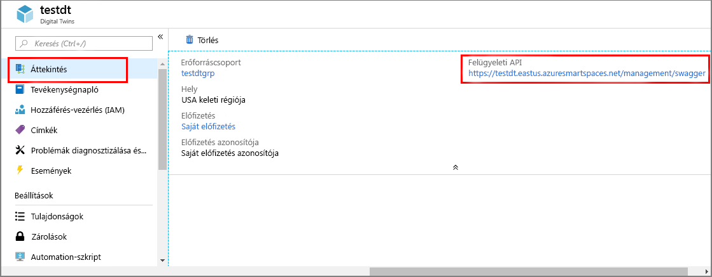

1. Jelentkezzen be az [Azure Portalra](http://portal.azure.com).

1. A bal oldali navigációs panelen kattintson az **Erőforrás létrehozása** elemre. Keressen a *digital twins* kifejezésre, és válassza a **Digital Twins (előzetes verzió)** lehetőséget. Az üzembe helyezés elindításához kattintson a **Létrehozás** gombra.

    

1. A **Digital Twins** panelen adja meg a következő adatokat:
   * **Erőforrás neve**: Adjon meg egy egyedi nevet a Digital Twins-példány számára.
   * **Előfizetés**: Válassza ki az adott Digital Twins-példány létrehozásához használni kívánt előfizetést. 
   * **Erőforráscsoport**: A listából válasszon ki vagy hozzon létre egy [erőforráscsoportot](https://docs.microsoft.com/azure/azure-resource-manager/resource-group-overview#resource-groups) a Digital Twins-példány számára.
   * **Hely**: Válassza ki az eszközökhöz legközelebbi helyet.

    

1. Tekintse át a Digital Twins adatait, majd kattintson a **Létrehozás** gombra. A Digital Twins-példány létrehozása néhány percet vehet igénybe. A létrehozás folyamatát az **Értesítések** panelen követheti nyomon.

1. Nyissa meg a Digital Twins-példány **Áttekintés** paneljét. A **felügyeleti API** alatt egy hivatkozás látható.

    1. A **felügyeleti API** URL-címének formátuma: **_https://yourDigitalTwinsName.yourLocation.azuresmartspaces.net/management/swagger_**. Ez az URL-cím az Ön példányára vonatkozó Azure Digital Twins REST API-dokumentációra mutat. Az API-dokumentáció értelmezésével és használatával kapcsolatban tekintse át [az Azure Digital Twins Swagger használatát](../articles/digital-twins/how-to-use-swagger.md) ismertető cikket.

    1. Módosítsa a **felügyeleti API** URL-címét a következő formátumra: **_https://yourDigitalTwinsName.yourLocation.azuresmartspaces.net/management/api/v1.0/_**. Az alkalmazás a módosított URL-címet használja majd kiindulási URL-címként a példány eléréséhez. Másolja ezt a módosított URL-címet egy ideiglenes fájlba. A következő szakaszban szükség lesz rá.

    