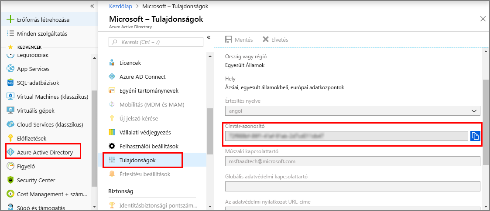
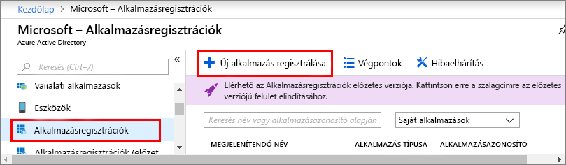
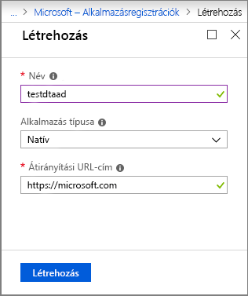
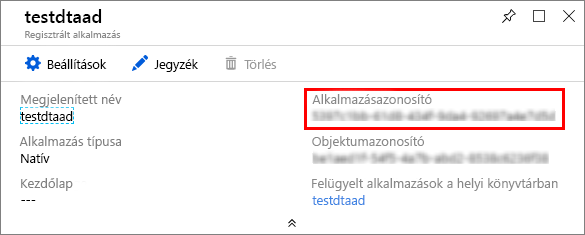

1. Az a [az Azure portal](https://portal.azure.com), nyissa meg **Azure Active Directory** a bal oldali ablaktáblán, és ezután nyissa meg a **tulajdonságok** ablaktáblán. Másolja ki a **Címtár-azonosítót** egy ideiglenes fájlba. A mintaalkalmazás konfigurálását a következő szakaszban ezt az értéket fogja használni.

    

1. Nyissa meg a **alkalmazásregisztrációk** ablaktáblán, és válassza ki a **új alkalmazásregisztráció** gombra.

    

1. Adjon egy rövid nevet a az alkalmazás regisztrációját a **neve** mezőbe. Válasszon **alkalmazástípus** , **natív**, és **átirányítási URI-t** , `https://microsoft.com`. Kattintson a **Létrehozás** gombra.

    

1. Nyissa meg a regisztrált alkalmazást, és másolja az értékét a **Alkalmazásazonosító** mezőt egy ideiglenes fájlba. Ez az érték azonosítja az Azure Active Directory-alkalmazást. A mintaalkalmazás konfigurálását az alábbi szakaszok az Alkalmazásazonosítót fogja használni.

    

1. Az alkalmazás regisztrációs panel megnyitásához. Válassza ki **beállítások** > **szükséges engedélyek**, majd:

   a. Válassza ki **Hozzáadás** megnyitásához a bal felső a **API-hozzáférés hozzáadása** ablaktáblán.

   b. Válassza ki **API kiválasztása** és keressen rá a **Azure digitális Twins**. Ha a keresés nem találja meg az API-t, keressen inkább az **Azure Smart Spaces** kifejezésre.

   c. Válassza ki a **Azure digitális Twins (Azure intelligens tárolóhelyek szolgáltatása)** lehetőséget, majd válassza a **kiválasztása**.

   d. Válasszon **engedélyek kiválasztása**. Válassza ki a **olvasási/írási hozzáférést** delegált engedélyeket jelölőnégyzetet, majd válassza a **kiválasztása**.

   e. Válassza ki **kész** a a **API-hozzáférés hozzáadása** ablaktáblán.

   f. Az a **szükséges engedélyek** panelen válassza a **engedélyeket** gombra, és fogadja el a visszaigazolás, amely akkor jelenik meg.

      
