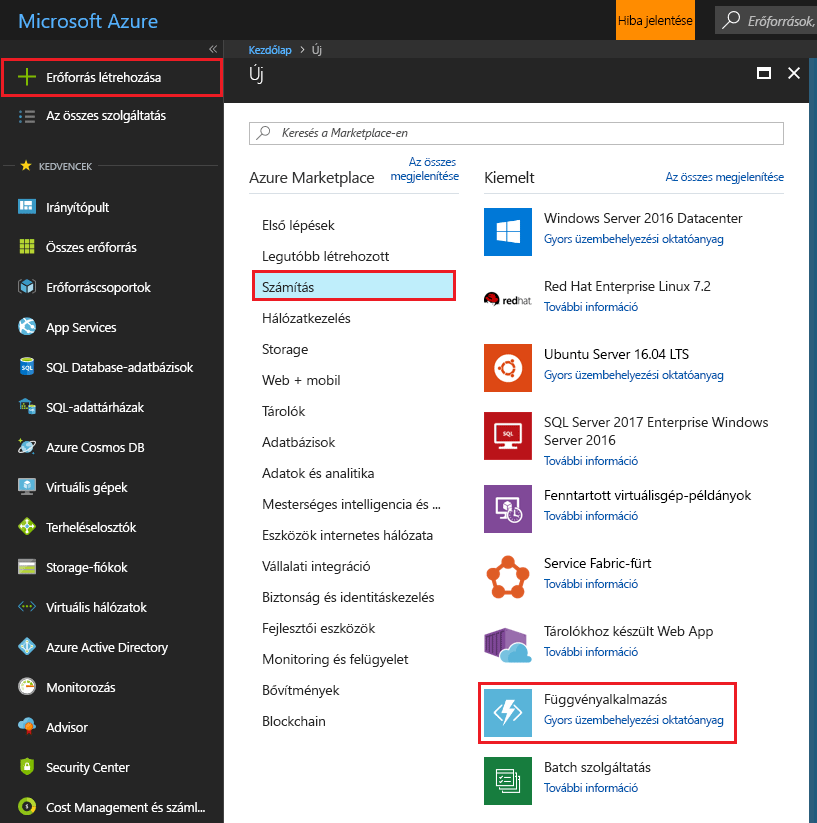
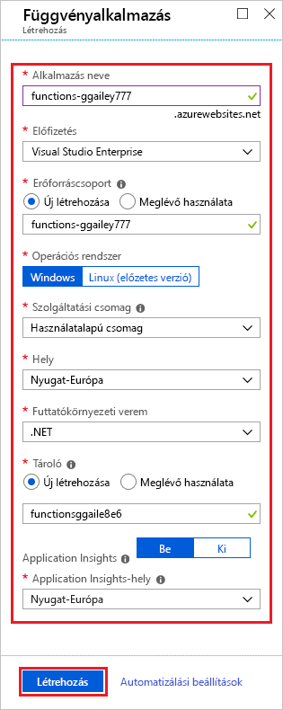
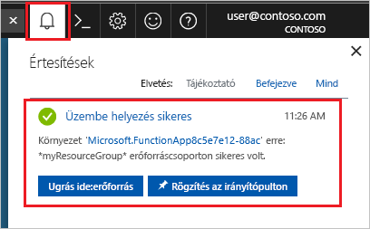

1. Kattintson a **új** gomb megtalálható-e az Azure portál bal felső sarkában majd select **számítási** > **függvény App**. 

    

2. Függvény app beállítást használja, a kép az alábbi táblázatban megadottak szerint.

    

    | Beállítás      | Ajánlott érték  | Leírás                                        |
    | ------------ |  ------- | -------------------------------------------------- |
    | **Alkalmazás neve** | Globálisan egyedi név | Az új függvényalkalmazást azonosító név. Érvénytelen karakterek vannak `a-z`, `0-9`, és `-`.  | 
    | **Előfizetés** | Az Ön előfizetése | Az előfizetés az új függvény alkalmazás létrehozásakor használt. | 
    | **[Erőforráscsoport](../articles/azure-resource-manager/resource-group-overview.md)** |  myResourceGroup | Az új erőforráscsoport neve, amelyben létrehozza a függvényalkalmazást. | 
    | **OS** | Windows | Kiszolgáló nélküli üzemeltető érhető el jelenleg csak Windows futtatásakor. Linux üzemeltet, lásd: [hozzon létre az első függvényét az Azure parancssori felület használatával Linux rendszeren futó](../articles/azure-functions/functions-create-first-azure-function-azure-cli-linux.md). |
    | **[Szolgáltatási csomag](../articles/azure-functions/functions-scale.md)** |   Használatalapú csomag | Szolgáltatási csomag, amely meghatározza az erőforrások lefoglalását a függvényalkalmazáshoz. Az alapértelmezett **használatalapú csomagban** az erőforrások hozzáadása dinamikusan történik a függvények igényeinek megfelelően. Ezen [kiszolgáló nélküli](https://azure.microsoft.com/overview/serverless-computing/) üzemeltet, csak kell fizetnie a funkciók futtatásakor.   |
    | **Hely** | Nyugat-Európa | Válasszon egy [régió](https://azure.microsoft.com/regions/) környéken vagy egyéb szolgáltatásokat a funkciók eléréséhez. |
    | **[Tárfiók](../articles/storage/common/storage-create-storage-account.md#create-a-storage-account)** |  Globálisan egyedi név |  A függvényalkalmazás által használt új tárfiók neve. A tárfiókok neve 3–24 karakter hosszúságú lehet, és csak számokból és kisbetűkből állhat. Meglévő fiókot is használhat. |

1. Kattintson a **Létrehozás** elemre az új függvényalkalmazás létrehozásához és üzembe helyezéséhez. Az értesítési ikon a portál jobb felső sarkában kattintva figyelheti a központi telepítés állapotát. 

    

    Kattintson a **forrást** az új függvény alkalmazás viszi.
