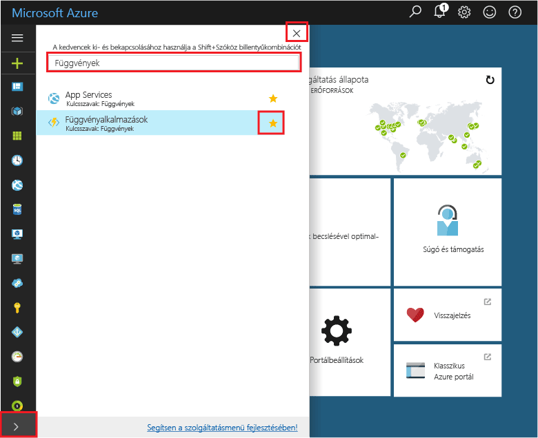
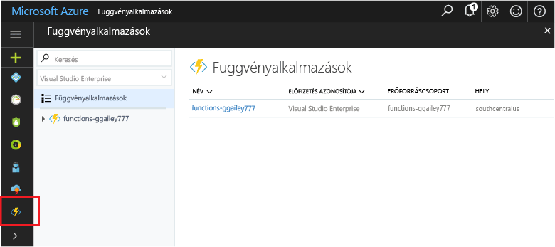

## Függvényalkalmazások felvétele a portál kedvencei közé 

Ha még nem tette meg, vegyen fel függvényalkalmazásokat a kedvencek közé az Azure Portalon. Így könnyebben megtalálhatja a függvényalkalmazásait. Ha már megtette ezt, ugorjon a következő szakaszra. 

1. Jelentkezzen be az [Azure portálra](https://portal.azure.com/).

2. A bal alsó sarokban található nyílra kattintva bontsa ki az összes szolgáltatást, írja be a `Functions` kifejezést a **Szűrő** mezőbe, majd kattintson a **Függvényalkalmazások** elem melletti csillagra.  
 
    

    Ezzel felveheti a Függvények ikont a portál bal oldali menüjébe.

3. Zárja be a menüt, majd a Függvények ikon megtekintéséhez görgessen le a képernyő aljára. Erre az ikonra kattintva megtekintheti a függvényalkalmazásainak listáját. Kattintson a függvényalkalmazásra az alkalmazásban található függvények használatához. 
 
    
 
     