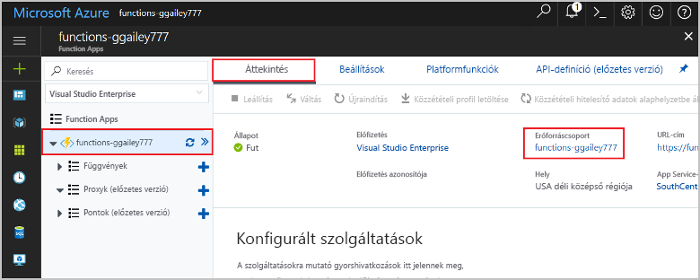

Az ebben a gyűjteményben lévő többi rövid útmutató erre a rövid útmutatóra épít. Ha azt tervezi, hogy az ezt rövid útmutatókkal vagy az oktatóanyagokkal dolgozik tovább, akkor ne törölje az ebben a rövid útmutatóban létrehozott erőforrásokat. 

Ha folytatja a munkát, kattintson a függvényalkalmazáshoz tartozó **Erőforráscsoport** elemre a portálon, és kattintson a **Törlés** gombra. 

