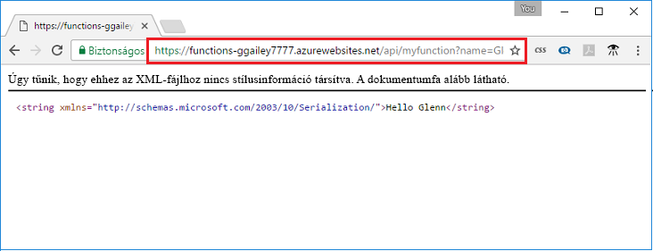

## <a name="test"></a>A függvény tesztelése

Ellenőrizze az üzembe helyezett függvényt a cURL használatával Mac vagy Linux rendszerű számítógépen vagy a Bash használatával Windows rendszerű számítógépen. Hajtsa végre a következő cURL parancsot úgy, hogy a `<app_name>` helyőrzőt lecseréli a függvényalkalmazás nevére. Fűzze hozzá a `&name=<yourname>` lekérdezési sztringet az URL-hez.

```bash
curl https://<app_name>.azurewebsites.net/api/HttpTrigger?name=<yourname>
```  

  

Ha a parancssorban nem érhető el a cURL, írja be ugyanezt az URL-t a webböngészője címsorába. Ezúttal is helyettesítse be a `<app_name>` helyőrző helyére a függvényalkalmazás nevét, az URL-címhez pedig fűzze hozzá a `&name=<yourname>` lekérdezési sztringértéket, majd hajtsa végre a kérést.

    https://<app_name>.azurewebsites.net/api/HttpTrigger?name=<yourname>
   
  
