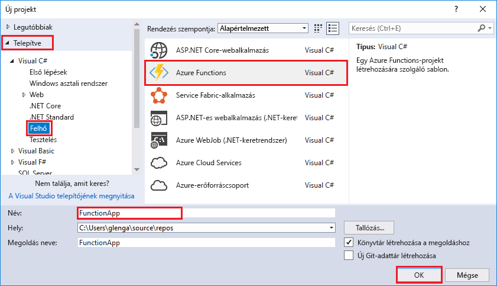
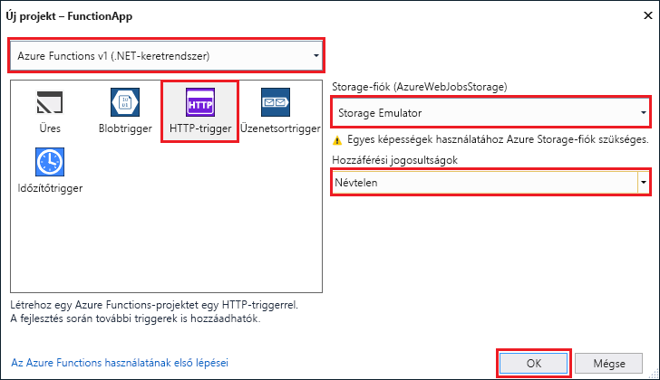

A Visual Studio Azure Functions projektsablonja egy olyan projektet hoz létre, amely közzétehető egy Azure-függvényalkalmazásban. Egy függvény app lehetővé funkciók csoportosítása a kezeléshez, a központi telepítés és az erőforrás-megosztás logikai egységet.   

1. A Visual Studio válassza **új** > **projekt** a a **fájl** menü. 

2. Az a **új projekt** párbeszédablakban válassza **telepített**, bontsa ki a **Visual C#** > **felhő**, jelölje be **Azure Funkciók**, adjon meg egy **neve** a projektet, majd kattintson a **OK**. A függvényalkalmazás nevének egy C#-névtérként is érvényesnek kell lennie, ezért ne használjon aláhúzásjeleket, kötőjeleket vagy más nem alfanumerikus karaktereket. 

     

2. A kép a következő táblázatban megadott beállítások használatát.
 
     

    | Beállítás      | Ajánlott érték  | Leírás                      |
    | ------------ |  ------- |----------------------------------------- |
    | **Verzió** | Azure Functions v1  (.NET-keretrendszer) | Ezzel létrehoz egy függvény projekthez az Azure Functions a 1-es verziójú futási idejű. A futtatókörnyezet 2-es verzióját, amely támogatja a .NET Core, jelenleg előzetes verzió. További információkért lásd: [Azure Functions futásidejű célverzió hogyan](../articles/azure-functions/functions-versions.md).   | 
    | **Sablon** | HTTP eseményindító | Ezzel létrehoz egy HTTP-kérés függvényt. |
    | **Storage-fiók**  | Storage Emulator | Egy HTTP-eseményindítóval nem használ a tárolási fiók kapcsolat. Minden más eseményindító szükséges tárolási fiók érvényes kapcsolati karakterláncot. |
    | **Hozzáférési jogok** | Névtelen | A létrehozott függvény is elindítható a bármely ügyfél kulcs megadása nélkül. Ez a beállítás engedélyezési megkönnyíti az új függvényt. Az engedélyezési és további információkért lásd: [engedélyezési kulcsok](../articles/azure-functions/functions-bindings-http-webhook.md#authorization-keys) a a [HTTP és a webhook kötések](../articles/azure-functions/functions-bindings-http-webhook.md). |         
3. Kattintson a **OK** a függvény létrehozásához a projekt és HTTP indított függvény. 

