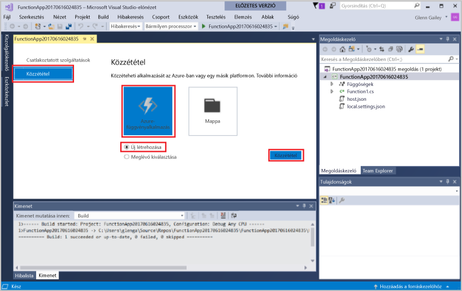
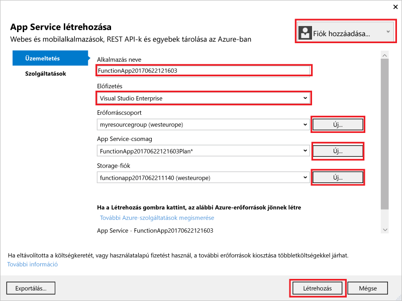
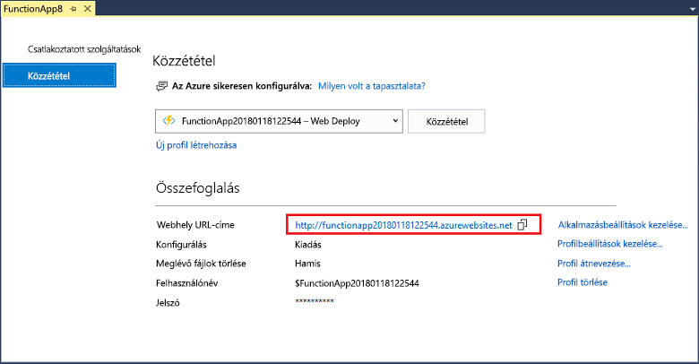

1. A **Megoldáskezelőben** kattintson a jobb gombbal a projektre, és válassza a **Publish** (Közzététel) lehetőséget. Válasszon **új** , majd **közzététele**. 

    

2. Ha a Visual Studio már Azure-fiókja még nem kapcsolódik, válassza ki a **fiók hozzáadása...** .  

3. Az **Create App Service** (Alkalmazásszolgáltatás létrehozása) párbeszédpanelen alkalmazza az **Hosting** (Üzemeltetés) beállításait a következő táblázatban megadott módon: 

    

    | Beállítás      | Ajánlott érték  | Leírás                                |
    | ------------ |  ------- | -------------------------------------------------- |
    | **Alkalmazás neve** | Globálisan egyedi név | Az új függvényalkalmazást azonosító egyedi név. |
    | **Előfizetés** | Válassza ki az előfizetését | A használandó előfizetés. |
    | **[Erőforráscsoport](../articles/azure-resource-manager/resource-group-overview.md)** | myResourceGroup |  Az erőforráscsoport neve, amelyben létrehozza a függvényalkalmazást. Válasszon **új** egy új erőforráscsoport létrehozásához.|
    | **[App Service-csomag](../articles/azure-functions/functions-scale.md)** | Használatalapú csomag | Ügyeljen arra, hogy válassza ki a **fogyasztás** alatt **mérete** kattintás után **új** hozhat létre egy új tervet. Válassza ki, egy **hely** a egy [régió](https://azure.microsoft.com/regions/) környéken vagy egyéb szolgáltatásokat a funkciók eléréséhez.  |

    >[!NOTE]
    >A Functions futtatókörnyezete Azure storage-fiók használata szükséges. Emiatt egy új Azure Storage-fiók létrejön egy függvény alkalmazás létrehozásakor.

4. Kattintson a **létrehozása** egy függvény alkalmazást és a kapcsolódó erőforrások létrehozása az Azure ezekkel a beállításokkal, és telepítse függvény projekt kódját. 

5. A telepítés befejezése után jegyezze fel a **webhely URL-címe** értéket, amely a cím, a függvény alkalmazás az Azure-ban.

    
