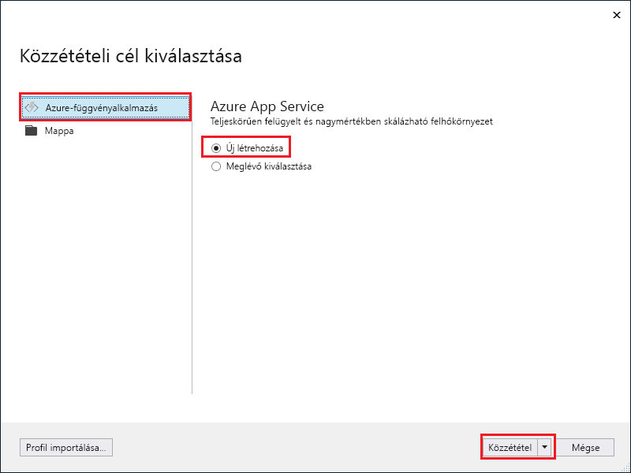

1. A **Megoldáskezelőben** kattintson a jobb gombbal a projektre, és válassza a **Publish** (Közzététel) lehetőséget.

2. Válassza az **Azure-függvényalkalmazás**, az **Új létrehozása**, majd a **Közzététel** lehetőséget.

    

    Ha engedélyezi a **futtatást a zip-ből**, az Azure-beli függvényalkalmazás közvetlenül a telepítőcsomagból fut. További információért lásd [az Azure Functions csomagfájlból történő futtatásával](../articles/azure-functions/run-functions-from-deployment-package.md) foglalkozó cikket.

3. Ha még nem csatlakoztatta a Visual Studiót az Azure-fiókjához, válassza a **Fiók hozzáadása...** lehetőséget.

4. Az **App Service létrehozása** párbeszédpanelen alkalmazza a kép alatti táblázatban megadott **Üzemeltetési** beállításokat:

    

    | Beállítás      | Ajánlott érték  | Leírás                                |
    | ------------ |  ------- | -------------------------------------------------- |
    | **Alkalmazás neve** | Globálisan egyedi név | Az új függvényalkalmazást azonosító egyedi név. |
    | **Előfizetés** | Válassza ki az előfizetését | A használandó előfizetés. |
    | **[Erőforráscsoport](../articles/azure-resource-manager/resource-group-overview.md)** | myResourceGroup |  Az erőforráscsoport neve, amelyben létrehozza a függvényalkalmazást. Válassza az **Új** elemet egy új erőforráscsoport létrehozásához.|
    | **[App Service-csomag](../articles/azure-functions/functions-scale.md)** | Használatalapú csomag | Miután rákattintott az **Új** elemre a csomag létrehozásához, győződjön meg róla, hogy a **Méret** elemnél a **Használatalapú** lehetőséget választja ki egy kiszolgáló nélküli csomag létrehozásához. Ezenkívül válasszon ki egy **Helyet** egy, a közelben, vagy a függvények által elért más szolgáltatások közelében található [régióban](https://azure.microsoft.com/regions/). Ha nem **használatalapú** csomagot használ, foglalkoznia kell a [függvényalkalmazás méretezésével](../articles/azure-functions/functions-scale.md).  |
    | **[Storage-fiók](../articles/storage/common/storage-quickstart-create-account.md)** | Általános célú Storage-fiók | A Functions futtatókörnyezetének szüksége van egy Azure Storage-fiókra. Kattintson az **Új** elemre egy általános célú tárfiók létrehozásához. Meglévő fiókot is használhat, amennyiben az megfelel a [tárfiókokra vonatkozó követelményeknek](../articles/azure-functions/functions-scale.md#storage-account-requirements).  |

5. Kattintson a **Létrehozás** elemre egy függvényalkalmazás és a kapcsolódó erőforrások Azure-ban való létrehozásához ezekkel a beállításokkal, illetve a függvény projektkódjának üzembe helyezéséhez. 

6. Miután az üzembe helyezés befejeződött, jegyezze fel a **webhely URL-címét**, amely a függvényalkalmazás címe az Azure-ban.

    
