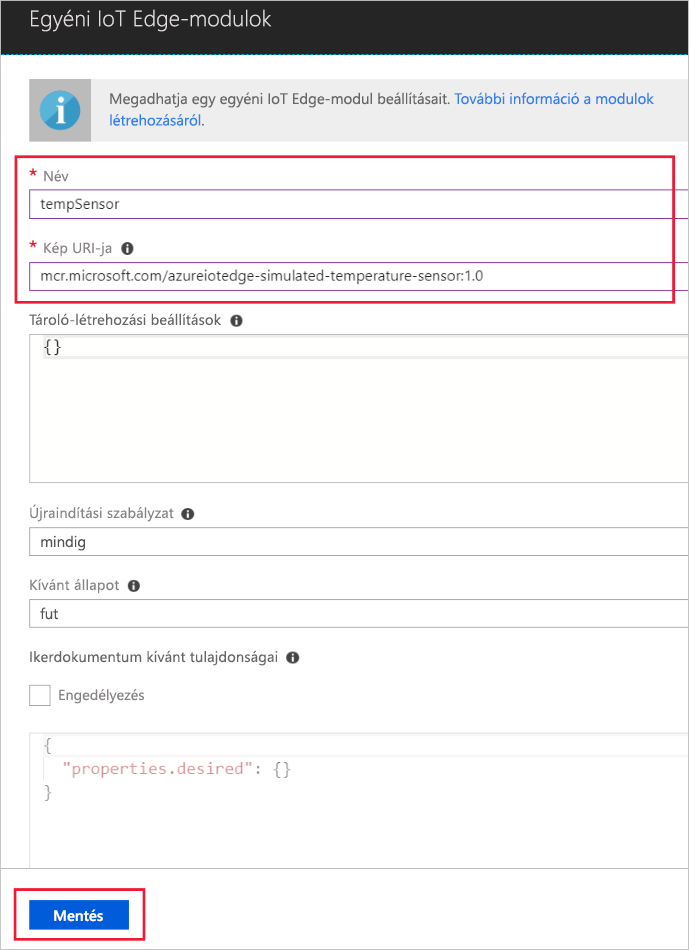

Egy Azure IoT peremhálózati főbb képességei van tudnak modulok az eszközökre telepíteni kívánt IoT peremhálózati a felhőből. Egy IoT-Edge-modul egy végrehajtható csomag valósul meg a tároló. Ebben a szakaszban telepít egy modul, amely a szimulált eszköz telemetriai adatokat állít elő. 

1. Az Azure-portálon lépjen az IoT hub.
1. Ugrás a **IoT peremhálózati (előzetes verzió)** és az IoT-peremhálózati eszköz kiválasztásához.
1. Válassza ki **modulok beállítása**.
1. Válassza ki **IoT peremhálózati modul hozzá lesz adva**.
1. Az a **neve** mezőbe írja be `tempSensor`. 
1. Az a **lemezkép URI** mezőbe írja be `microsoft/azureiotedge-simulated-temperature-sensor:1.0-preview`. 
1. Hagyja változatlanul az egyéb beállításokat, és válassza ki **mentése**.

   

1. Vissza a **modulok hozzáadása** jelölje be a lépésben **következő**.
1. Az a **adja meg az útvonalakat** jelölje be a lépésben **tovább**.
1. Az a **felülvizsgálati sablonja** lépésben jelölje be **Submit**.
1. Térjen vissza az eszköz részleteit megjelenítő oldalra, és válassza ki **frissítése**. Meg kell jelennie az új tempSensor modul az IoT-Edge futásidejű mentén. 

   ![A telepített modulok listájának megtekintése tempSensor][1]

<!-- Images -->
[1]: ../articles/iot-edge/media/tutorial-simulate-device-windows/view-module.png