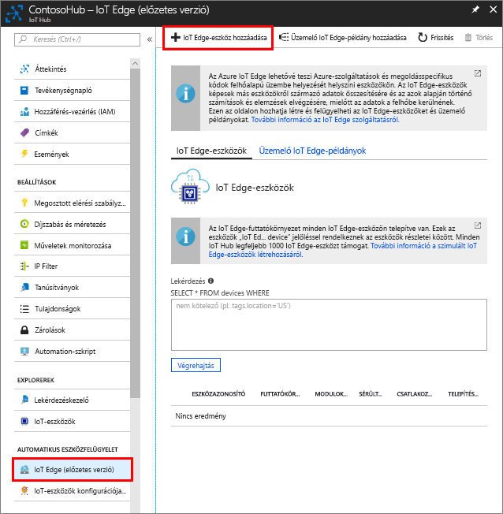

Hozzon létre egy eszközidentitást a szimulált eszközhöz, hogy az kommunikálhasson az IoT Hubbal. Mivel az IoT Edge-eszközök másként viselkednek, mint a hagyományos IoT-eszközök, és kezelésük is másként történik, ezért IoT Edge-eszközként kell deklarálni a kezdetektől fogva. 

1. Az Azure Portalon keresse meg az IoT-központot.
1. Válassza az **IoT Edge**, majd az **Add IoT Edge Device** (IoT Edge-eszköz hozzáadása) lehetőséget.

   

1. Adjon meg egy egyedi eszközazonosítót szimulált eszközének.
1. Az eszköz hozzáadásához kattintson a **Save** (Mentés) gombra.
1. Válassza ki új eszközét az eszközök listájából.
1. Másolja és mentse a **kapcsolati sztring elsődleges kulcsának** értékét. Erre az értékre a következő szakaszban, az IoT Edge-futtatókörnyezet konfigurálásához lesz szükség. 

