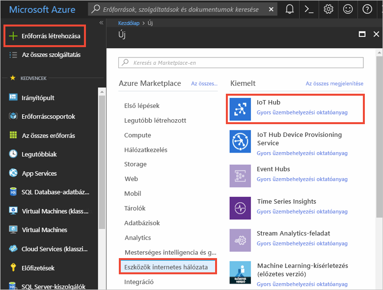
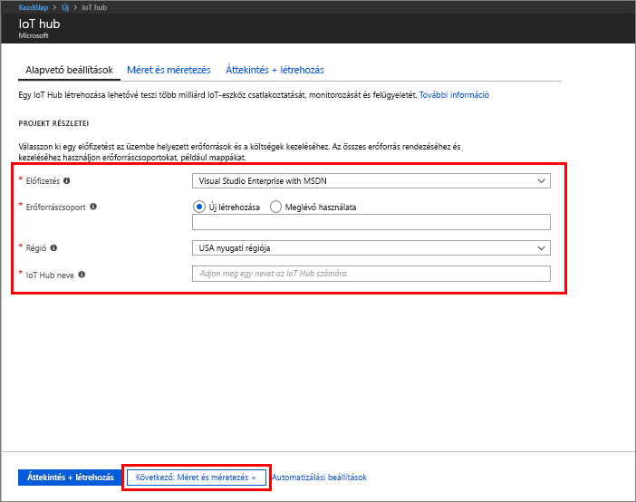
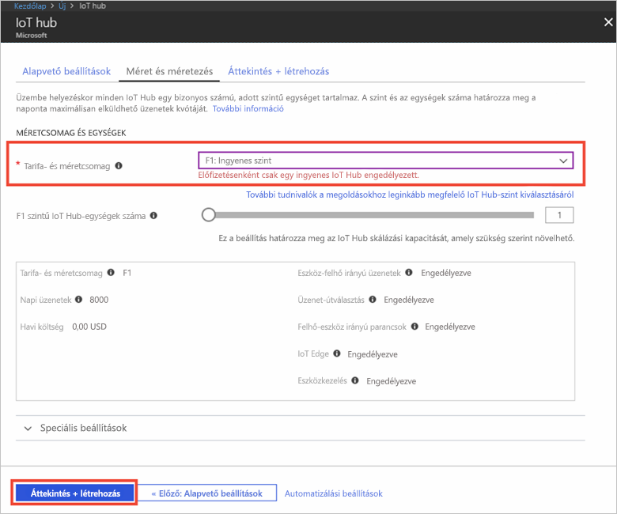

1. Jelentkezzen be az [Azure Portalra](https://portal.azure.com/).

2. Válassza az **Erőforrás létrehozása** > **Eszközök internetes hálózata** > **IoT Hub** elemet.
   
    

3. Az **IoT Hub** panelen adja meg a következő adatokat az IoT Hub számára:

   * **Előfizetés**: Válassza ki az IoT Hub létrehozásához használni kívánt előfizetést.

   * **Erőforráscsoport**: Hozzon létre egy erőforráscsoportot az IoT Hub üzemeltetéséhez, vagy használjon egy meglévőt. További információkat az [Azure-erőforrások erőforráscsoportokkal való kezeléséről](../articles/azure-resource-manager/resource-group-portal.md) szóló cikkben olvashat.

   * **Régió**: Válassza ki az Önhöz legközelebbi helyet.

   * **Név**: Adja meg az IoT Hub nevét. Ha a megadott név elérhető, egy zöld pipa jelenik meg.

   [!INCLUDE [iot-hub-pii-note-naming-hub](iot-hub-pii-note-naming-hub.md)]

   

4. Válassza a **Tovább: Méret és skálázás** elemet az IoT hub létrehozásának folytatásához. 

5. Válasszon **tarifacsomag és méretet**. Erre a cikkre vonatkozóan válassza az **F1 – Ingyenes** szintet, ha elérhető az előfizetésében. További információkat a [díjszabással](https://azure.microsoft.com/pricing/details/iot-hub/) kapcsolatos lapon olvashat.

   

6. Válassza az **Áttekintés + létrehozás** lehetőséget.

7. Tekintse át az IoT Hub adatait, majd kattintson a **Létrehozás** gombra. Az IoT Hub létrehozása eltarthat néhány percig. A létrehozás folyamatát az **Értesítések** panelen követheti nyomon.