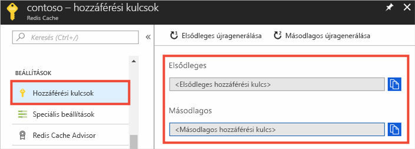
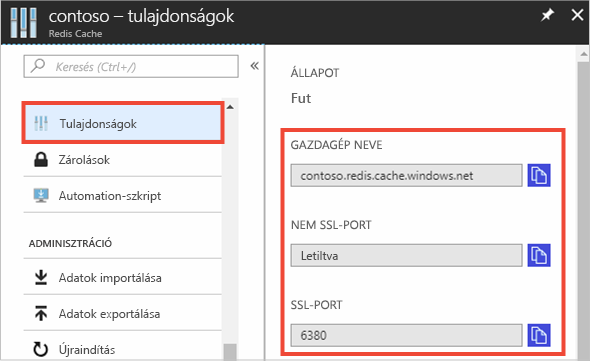

### Gazdagépnév, portok és hozzáférési kulcsok lekérése az Azure Portalon

Amikor egy Azure Azure Cache a Redis-példányt, akkor a gyorsítótár-ügyfelek a gyorsítótár kell a gazdagépnév, portok és egy kulcsot. Egyes ügyfelek különböző neveken hivatkozhatnak ezekre az elemekre. Ezeket az információkat lekérheti az Azure Portalon.

#### A hozzáférési kulcsok és a gazdagépnév lekérése

1. A hozzáférési kulcsok az [Azure Portalon](https://portal.azure.com) történő lekéréséhez lépjen a gyorsítótárba, és válassza a **Hozzáférési kulcsok** lehetőséget. 

    

2. A gazdagépnév és a hozzáférési kulcsok lekéréséhez válassza a **Tulajdonságok** lehetőséget.

    

