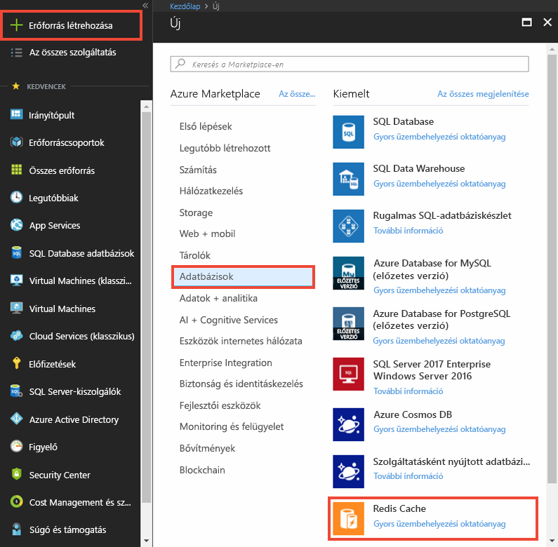
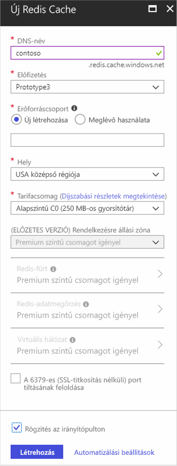
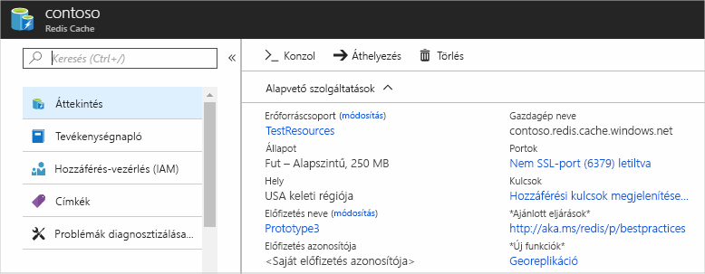

1. Gyorsítótár létrehozásához először jelentkezzen be az [Azure Portalra](https://portal.azure.com). Válassza ki **erőforrás létrehozása** > **adatbázisok** > **Azure Cache redis**.

    

2. A **új Azure Cache redis**, az új gyorsítótár beállításainak konfigurálásához.

    | Beállítás      | Ajánlott érték  | Leírás |
    | ------------ |  ------- | -------------------------------------------------- |
    | **DNS-név** | Globálisan egyedi név | A gyorsítótár neve. A gyorsítótár nevének 1–63 karakter hosszúságú sztringnek kell lennie, és kizárólag számokat, betűket és a `-` karaktert tartalmazhatja. A gyorsítótár neve nem kezdődhet a `-` karakterrel, és az egymást követő `-` karakterek nem érvényesek.  | 
    | **Előfizetés** | Az Ön előfizetése | Az előfizetés, amelyben az új Azure Cache Redis-példány létrejön. | 
    | **Erőforráscsoport** |  *TestResources* | Az új erőforráscsoport neve, amelyben létrehozza a gyorsítótárat. Ha egy alkalmazás összes erőforrását egy csoportban helyezi el, akkor mindet együtt kezelheti. Az erőforráscsoport törlése például az alkalmazáshoz társított összes erőforrást törli. | 
    | **Hely** | USA keleti régiója | Válasszon egy [régiót](https://azure.microsoft.com/regions/) a gyorsítótárat használó más szolgáltatások közelében. |
    | **[Tarifacsomag](https://azure.microsoft.com/pricing/details/cache/)** |  Alapszintű C0 (250 MB-os gyorsítótár) |  A tarifacsomag határozza meg a gyorsítótár méretét, teljesítményét és elérhető funkcióit. További információkért lásd: [Azure Cache Redis áttekintő](../articles/azure-cache-for-redis/cache-overview.md). |
    | **Rögzítés az irányítópulton** |  Kiválasztva | Rögzítheti az új gyorsítótárat az irányítópulton, hogy könnyen megtalálható legyen. |

     

3. Az új gyorsítótár beállításainak konfigurálása után válassza a **Létrehozás** lehetőséget. 

    A gyorsítótár létrehozása eltarthat néhány percig. A folyamat előrehaladásának állapotát az irányítópulton ellenőrizheti. Miután a gyorsítótár létrejött, az állapota **Fut**, és használatra kész.

    

