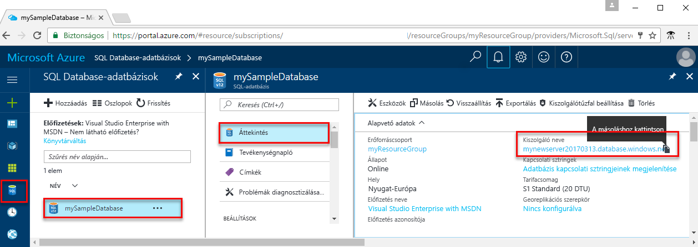

<!-- sql-database-connect-query-prerequisites-server-connection-info-includes.md 

## SQL server connection information
-->

Kérje le az Azure SQL-adatbázishoz való csatlakozáshoz szükséges kapcsolatadatokat. A későbbi eljárásokban szüksége lesz a teljes kiszolgálónévre, az adatbázis nevére és a bejelentkezési adatokra.

1. Jelentkezzen be az [Azure Portalra](https://portal.azure.com/).
2. Válassza az **SQL-adatbázisok** elemet a bal oldali menüben, majd kattintson az új adatbázisra az **SQL-adatbázisok** oldalon. 
3. Az adatbázis **Áttekintés** oldalán tekintse meg a teljes kiszolgálónevet, amint az az alábbi képen látható. Ha a mutatót a kiszolgáló neve fölé viszi, megjelenik a **Kattintson a másoláshoz** lehetőség.  

    

4. Ha elfelejtette a kiszolgálói bejelentkezési adatait, lépjen az SQL Database-kiszolgáló oldalára, ahol megtekintheti a kiszolgáló rendszergazdájának nevét. Szükség esetén kérjen új jelszót.

