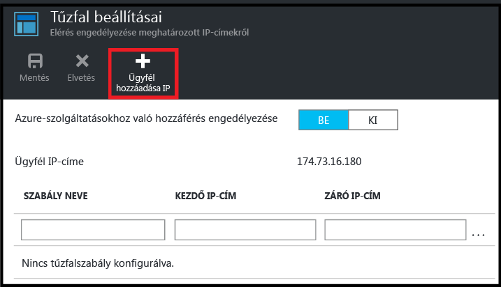

<!--
includes/sql-database-create-new-server-firewall-portal.md

Latest Freshness check:  2016-08-01 , rickbyh.

As of circa 2016-04-11, the following topics might include this include:
articles/sql-database/sql-database-get-started-tutorial.md
articles/sql-database/sql-database-configure-firewall-settings

-->
## Új Azure SQL kiszolgálószintű tűzfal létrehozása

Kövesse a következő lépéseket az Azure Portalon, hogy létrehozzon egy kiszolgálószintű tűzfalszabályt, amely kapcsolatokat engedélyez egy egyedi IP-címről (az Ön ügyfélszámítógépéről) vagy egy teljes IP-címtartományról egy SQL Database logikai kiszolgálóra.

1. Ha jelenleg nem csatlakozik, jelentkezzen be az [Azure Portalra](http://portal.azure.com).
2. Az alapértelmezett panelen kattintson az **SQL Server-példányok** elemre.

    

3. Az **SQL Server-példányok** panelen kattintson arra a kiszolgálóra, ahol létre kívánja hozni a tűzfalszabályt.

    

4. Tekintse át a kiszolgálója tulajdonságait.

    

5. A **Beállítások** panelen kattintson a **Tűzfal** elemre.

    

    > [AZURE.NOTE] A kiszolgálószintű **Tűzfalbeállítások** panelt az **Adatbázis** panel eszköztárából is elérheti.

6. Kattintson az **Ügyfél IP-címének hozzáadása** elemre, hogy az Azure létrehozza az ügyfél IP-címéhez való szabályt.

      

7. Vagy kattintson a hozzáadott IP-címre, és szerkessze a tűzfal címét egy IP-címtartományhoz való hozzáférés engedélyezéséhez.

      

8. Kattintson a **Mentés** gombra egy kiszolgálószintű tűzfalszabály létrehozásához.

     

    >[AZURE.IMPORTANT] Az ügyfél IP-címe időnként változhat, így előfordulhat, hogy új tűzfalszabály létrehozásáig nem férhet hozzá a kiszolgálóhoz. IP-címét ellenőrizheti a [Bing](http://www.bing.com/search?q=my%20ip%20address) használatával. Ezután hozzáadhat egy egyedi IP-címet vagy egy IP-címtartományt. Részletek: [Manage firewall settings](sql-database-configure-firewall-settings.md#manage-existing-server-level-firewall-rules-through-the-azure-portal) (Tűzfalbeállítások kezelése).

<!--HONumber=Sep16_HO4-->

