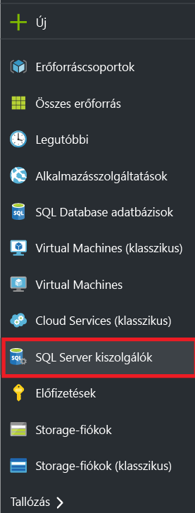
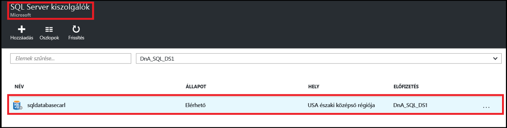
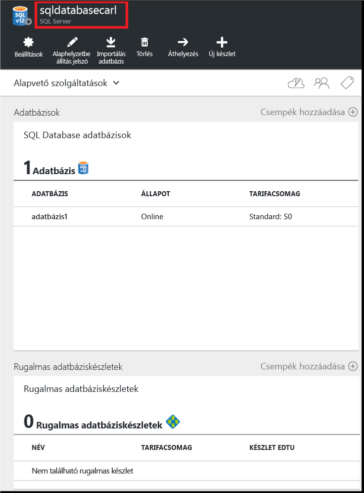
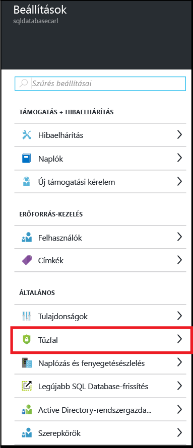
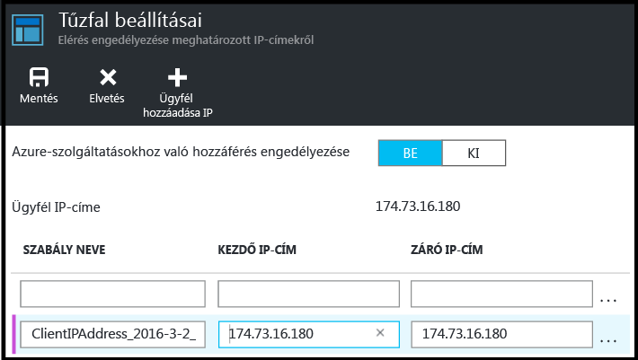
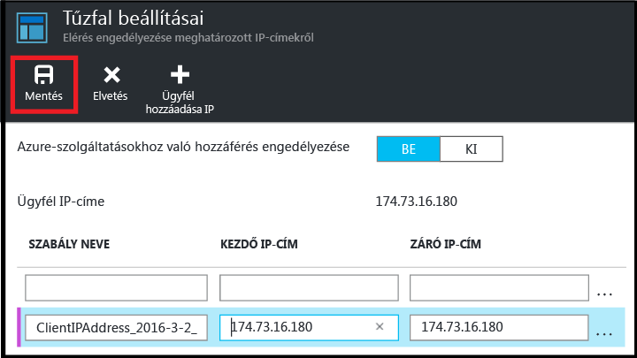

<!--
includes/sql-database-create-new-server-firewall-portal.md

Latest Freshness check:  2016-04-11 , carlrab.

As of circa 2016-04-11, the following topics might include this include:
articles/sql-database/sql-database-get-started-tutorial.md
articles/sql-database/sql-database-configure-firewall-settings

-->
## Új Azure SQL kiszolgálószintű tűzfal létrehozása

Kövesse a következő lépéseket az Azure portálon, hogy létrehozzon egy kiszolgálószintű tűzfalszabályt, amely kapcsolatokat engedélyez egy egyedi IP-címről (az Ön ügyfélszámítógépéről) vagy egy teljes IP-címtartományról egy SQL logikai kiszolgálóra. 

1. Ha jelenleg nincs csatlakozva, jelentkezzen be az [Azure portálra](http://portal.azure.com).
2. Az alapértelmezett panelen kattintson az **SQL Server** elemre.

    

2. Az SQL Server panelen kattintson arra az SQL-kiszolgálóra, ahol létrehozná a tűzfalszabályt. 

    
           
3. Tekintse át a kiszolgálója tulajdonságait.

    
      
4. A Beállítások panelen kattintson a **Tűzfal** elemre.

    
    

    > [AZURE.IMPORTANT] Ha nem látja a **Tűzfal** beállítást a panelen, lépjen vissza, és győződjön meg arról, hogy az SQL Database logikai kiszolgáló paneljét nézi, és nem egy SQL-adatbázisét.

5. Kattintson az **Ügyfél IP-címének hozzáadása** lehetőségre az ügyfele IP-címéhez való szabály létrehozásához.

      ![új kiszolgálótűzfal]    (./media/sql-database-create-new-server-firewall-portal/sql-database-create-new-server-firewall-portal-5.png)

6. Másik lehetőségként kattinthat a hozzáadott IP-címre, és szerkesztheti a tűzfal címét egy IP-címtartományhoz való hozzáférés engedélyezéséhez.

      
    
7. Kattintson a **Mentés** gombra egy kiszolgálószintű tűzfalszabály létrehozásához.

     

    >[AZURE.IMPORTANT] Az ügyfél IP-címe időnként változhat, így előfordulhat, hogy új szabály létrehozásáig nem férhet hozzá a kiszolgálóhoz. IP-címét ellenőrizheti a [Bing](http://www.bing.com/search?q=my%20ip%20address) használatával, és ezután hozzáadhat egy egyedi IP-címet vagy egy IP-címtartományt. Részletek: [Manage firewall settings](sql-database-configure-firewall-settings.md#manage-existing-server-level-firewall-rules-through-the-azure-portal) (Tűzfalbeállítások kezelése).

<!--HONumber=Jun16_HO2-->

