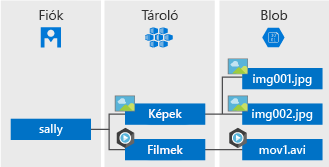

Az Azure Blob Storage a Microsoft felhőalapú objektumtárolási megoldása. A Blob Storage nagy mennyiségű strukturálatlan adat, például szöveg vagy bináris adatok tárolására van optimalizálva.

A Blob Storage a következőkhöz ideális:

* Képek vagy dokumentumok közvetlen szolgáltatása a böngészők számára.
* Fájlok tárolása megosztott hozzáféréshez.
* Video- és hangtartalom streamelése.
* Írás naplófájlokba.
* Adattárolás biztonsági mentésekhez és helyreállításhoz, vészhelyreállításhoz és archiváláshoz.
* Adattárolás helyszíni vagy az Azure-ban üzemeltetett szolgáltatásban való elemzéshez.

A Blob Storage tárolóban lévő objektumok a világon bárhonnan elérhetők HTTP- vagy HTTPS-kapcsolaton keresztül. A felhasználók vagy ügyfélalkalmazások URL-eken, az [Azure Storage REST API-n](https://docs.microsoft.com/rest/api/storageservices/blob-service-rest-api), az [Azure PowerShellen](https://docs.microsoft.com/powershell/module/azure.storage), az [Azure CLI-n](https://docs.microsoft.com/cli/azure/storage) vagy Azure Storage-ügyfélkódtárakon keresztül érhetik el a blobokat. A tároló ügyfélkódtárai több nyelven érhetők el, beleértve a [.NET](https://docs.microsoft.com/dotnet/api/overview/azure/storage/client), [Java](https://docs.microsoft.com/java/api/overview/azure/storage/client), [Node.js](http://azure.github.io/azure-storage-node), [Python](https://docs.microsoft.com/python/azure/), [PHP](http://azure.github.io/azure-storage-php/) és [Ruby](http://azure.github.io/azure-storage-ruby) nyelveket.

## A Blob szolgáltatással kapcsolatos fogalmak

A Blob Storage háromféle erőforrást tesz elérhetővé: a tárfiókot, a fiókban lévő tárolókat és a tárolókban lévő blobokat. Az alábbi ábra az ezen erőforrások közötti kapcsolatot mutatja be.

### Tárfiók

Az Azure Storage-ben lévő adatobjektumokhoz való mindenféle hozzáférés tárfiókokon keresztül valósul meg. További információkat az [Azure Storage-fiókokkal kapcsolatos tudnivalókat](../articles/storage/common/storage-create-storage-account.md?toc=%2fazure%2fstorage%2fblobs%2ftoc.json) ismertető témakörben olvashat.

### Tároló

A tárolók blobokat rendszereznek a fájlrendszerek mappáihoz hasonlóan. Minden blob egy tárolóban található. Egy tárfiók korlátlan számú tárolót tartalmazhat, egy tároló pedig korlátlan számú blob tárolására használható. Vegye figyelembe, hogy a tároló neve csak kisbetűket tartalmazhat.

### Blob
 
Az Azure Storage három különböző típusú blobot kínál: blokkblobokat, hozzáfűző blobokat és [lapblobokat](../articles/storage/blobs/storage-blob-pageblob-overview.md) (ezek a VHD-fájlokhoz használatosak).

* A blokkblobok szövegeket és bináris adatokat tárolnak legfeljebb nagyjából 4,7 TB méretig. A blokkblobok önállóan felügyelhető adatblokkokból állnak.
* A hozzáfűző blobok a blokkblobokhoz hasonlóan blokkokból állnak, azonban a hozzáfűzési műveletekhez vannak optimalizálva. A hozzáfűző blobok ideálisak például a virtuális gépek adatainak naplózásához és hasonló forgatókönyvekhez.
* A lapblobok véletlen hozzáférésű fájlokat tárolnak legfeljebb 8 TB méretig. A virtuális gépek alapját képező VHD-fájlokat lapblobok tárolják.

Minden blob egy tárolóban található. A tárolók hasonlóak a fájlrendszerek mappáihoz. A blobokat tovább rendezheti virtuális könyvtárakba, és úgy navigálhat közöttük, mint egy fájlrendszerben. 

A nagy adatkészleteknél, ahol a hálózati korlátok miatt irreális lenne az adatok vezetékes le- vagy feltöltése a Blob Storage-ba, elküldhet a Microsoftnak egy teljes merevlemez-készletet, hogy az adatokat közvetlenül az adatközpontból importálják vagy oda exportálják. További információk a [Microsoft Azure Import/Export szolgáltatás adatok a Blob Storage-ba való átviteléhez történő használatát](../articles/storage/common/storage-import-export-service.md) ismertető cikkben olvashatóak.
  
A tárolók és blobok elnevezésével kapcsolatos részletekért lásd: [Naming and Referencing Containers, Blobs, and Metadata](/rest/api/storageservices/Naming-and-Referencing-Containers--Blobs--and-Metadata) (Tárolók, blobok és metaadatok elnevezése és hivatkozása).
