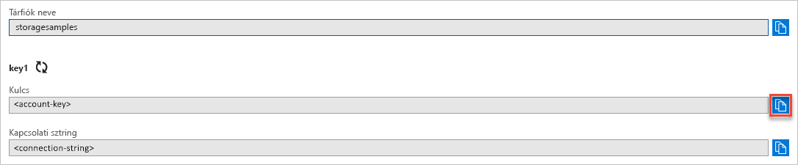

## A hitelesítési adatok másolása az Azure Portalról

A mintaalkalmazásnak hitelesítenie kell a tárfiókhoz való hozzáférést. A hitelesítéshez meg kell adnia az alkalmazásnak a tárfiókjához tartozó, kapcsolati sztring formátumú hitelesítő adatait. A tárfiók hitelesítő adatainak megtekintéséhez a következőt kell tennie:

1. Lépjen az [Azure Portalra](https://portal.azure.com).
2. Keresse meg a Storage-fiókját.
3. A tárfiók áttekintésének **Beállítások** szakaszában válassza a **Hozzáférési kulcsok** elemet. Megjelennek a fiókhoz tartozó hozzáférési kulcsok, valamint az egyes kulcsokhoz tartozó kapcsolati sztringek.
4. Jegyezze fel a tárfiók nevét, mert a hitelesítéshez meg kell majd adnia.   
5. Keresse meg a **Kulcs** értéket a **key1** területen, majd kattintson a **Másolás** gombra a fiókkulcs másolásához.

    
