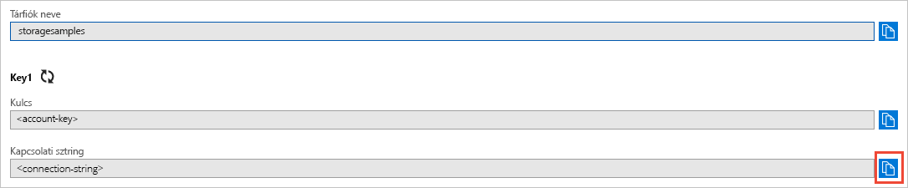

## A hitelesítési adatok másolása az Azure Portalról

A mintaalkalmazásnak hitelesítenie kell a tárfiókhoz való hozzáférést. A hitelesítéshez meg kell adnia az alkalmazásnak a tárfiókjához tartozó, kapcsolati karakterlánc formátumú hitelesítő adatait. A tárfiók hitelesítő adatainak megtekintéséhez a következőt kell tennie:

1. Lépjen az [Azure Portalra](https://portal.azure.com).
2. Keresse meg a Storage-fiókját.
3. A tárfiók áttekintésének **Beállítások** szakaszában válassza a **Hozzáférési kulcsok** elemet. Megjelennek a fiókhoz tartozó hozzáférési kulcsok, valamint az egyes kulcsokhoz tartozó kapcsolati karakterláncok.   
4. Keresse meg a **Kapcsolati karakterlánc** értéket a **key1** területen, és kattintson a **Másolás** gombra a kapcsolati karakterlánc másolásához. A kapcsolati karakterlánc értékét hozzáadja egy környezeti változóhoz a következő lépés során.

    
