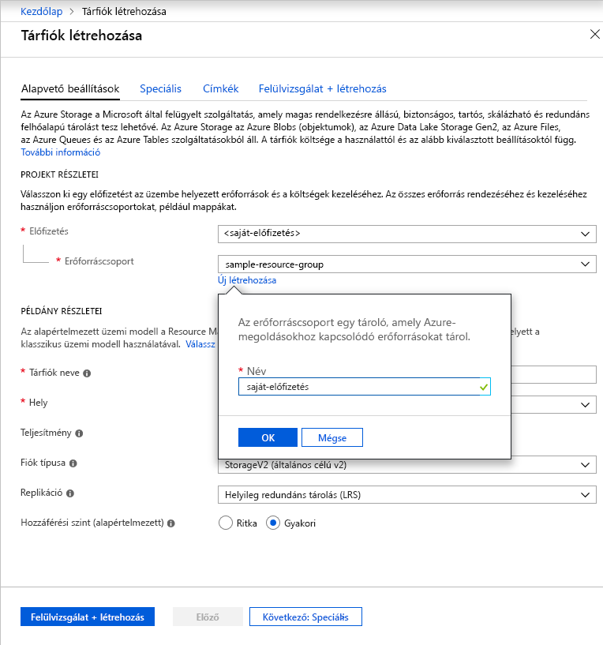

Kövesse az alábbi lépéseket egy általános célú v2-tárfiók létrehozásához az Azure Portalon:

1. Az Azure Portalon válassza a **Minden szolgáltatás** elemet. Az erőforrások listájába írja be a **Storage-fiókok** kifejezést. Ahogy elkezd gépelni, a lista a beírtak alapján szűri a lehetőségeket. Válassza a **Tárfiókok** lehetőséget.
1. A megjelenő **Storage-fiókok** ablakban válassza a **Hozzáadás** lehetőséget.
1. Válassza ki azt az előfizetést, amelyben létre kívánja hozni a tárfiókot.
1. Az **Erőforráscsoport** mező alatt válassza az **Új létrehozása** elemet. Az alábbi képen látható módon nevezze el az új erőforráscsoportot.

    

1. Ezután adja meg a tárfiók nevét. A választott névnek az Azure-on belül egyedinek kell lennie. A név 3–24 karakter hosszúságú lehet, és csak számokból és kisbetűkből állhat.
1. Válassza ki a tárfiókja helyét, vagy használja az alapértelmezett helyet.
1. Ne módosítsa a következő mezők alapértelmezett értékeit:

   |Mező  |Érték  |
   |---------|---------|
   |Üzemi modell     |Resource Manager         |
   |Teljesítmény     |Standard         |
   |Fióktípus     |StorageV2 (általános célú v2)         |
   |Replikáció     |Helyileg redundáns tárolás (LRS)         |
   |Hozzáférési szint     |Gyakori         |

1. A tárfiók beállításainak áttekintéséhez és a fiók létrehozásához válassza a **Felülvizsgálat + létrehozás** elemet.
1. Kattintson a **Létrehozás** gombra.

További információ a tárfiókok típusairól és a tárfiókok egyéb beállításairól: [Az Azure Storage-fiókok áttekintése](https://docs.microsoft.com/azure/storage/common/storage-account-overview). További információ az erőforráscsoportokkal kapcsolatban: [Az Azure Resource Manager áttekintése](https://docs.microsoft.com/azure/azure-resource-manager/resource-group-overview). 
