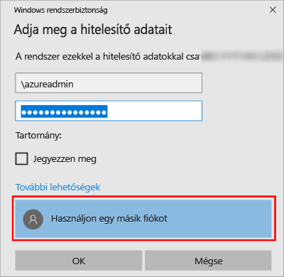

1. Miután az Azure virtuális gép létrejött és fut, kattintson a Virtual Machines ikonra az Azure Portalon a virtuális gépek megtekintéséhez.

1. Kattintson a három pontot ábrázoló gombra (**...**) az új virtuális gép mellett.

1. Kattintson a **Csatlakozás** gombra.

   

1. Nyissa meg a böngésző által a virtuális géphez letöltött **RDP**-fájlt.

1. A távoli asztali kapcsolat arról értesíti, hogy a távoli kapcsolat közzétevője nem azonosítható. Kattintson a **Csatlakozás** gombra a folytatáshoz.

1. A **Windows rendszerbiztonság** párbeszédpanelen kattintson a **Másik fiók használata** elemre. Ha ez a lehetőség nem látható, a **További lehetőségek** gombra kattintva jeleníthető meg. Adja meg a virtuális gép létrehozásakor konfigurált felhasználónevet és jelszót. A felhasználónév elé írjon egy fordított perjelet.

   

1. A csatlakozáshoz kattintson az **OK** gombra.
